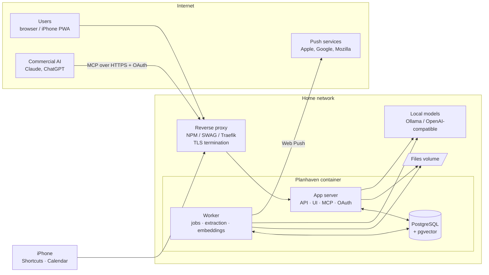
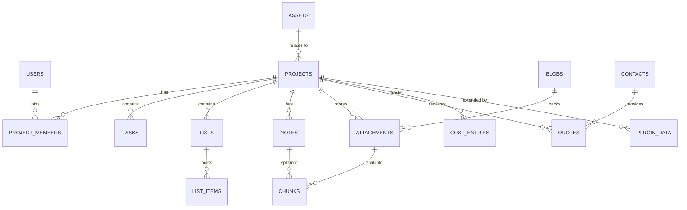

# Planhaven — Architecture

> **Status:** Draft v0.1 · **Last updated:** 2026-09-26
> **Tagline:** From idea to done.
> Companion documents: [`SECURITY.md`](SECURITY.md) (threat model and security controls),
> `docs/plugin-api.md` (to be written), `docs/adr/` (decision records).

This document describes what Planhaven is, how it is built, and why. It is the reference that
code and pull requests are checked against. When the code and this document disagree, one of
them is wrong and must be fixed in the same pull request.

---

## 1. Purpose and scope

Planhaven is a self-hosted web app for managing personal and household projects from the first
idea through to completion. It is designed for a household or small group of trusted people
running it on their own hardware (primarily Unraid), exposed to the internet behind a reverse
proxy.

Representative projects it must handle well:

| Project | What it exercises |
|---|---|
| Change Tacoma engine oil | Recurring work tied to an asset, parts list, service history |
| Winterize boat | Yearly checklist template, reminders |
| Fix roof / Remodel garage | Long multi-phase projects, budgets, shopping lists, photos |
| Furnace and AC replacement by contractor | Contacts, competing quotes, contracts, warranty documents |
| Design DIY smart speaker | Brainstorming with AI, design files, bill of materials |
| WLED lighting on dock decking | Parts lists, design notes, wiring diagrams |
| Cameras + Frigate on the home lab | Sensitive technical detail (network, camera placement) |
| Woodworking project | Plans, cut lists, sheet-goods optimization (plugin) |

### 1.1 Goals

- Track projects through a lifecycle: **Idea → Planning → Ready → In progress → Done → Archived**.
- Store tasks, lists (shopping, parts, checklists), notes, and attachments per project.
- Multi-user: every user starts with a clean slate; projects are shared explicitly.
- Real-time collaboration: several people edit the same note at once, and list changes
  appear on every device within seconds (§8.5).
- Work equally well on a phone and a desktop browser: one responsive web app (§13.5).
- Sync shopping lists and tasks to iPhone (Reminders via Shortcuts, Calendar via ICS feed,
  Web Push notifications, installable PWA).
- Answer questions about a project and its attachments using **local** AI models.
- Let **commercial** AI assistants (Claude, ChatGPT) brainstorm and write into the app through
  an MCP connector, storing notes that local models can use later.
- An **AI project assistant**, local or commercial, that creates and edits tasks, notes,
  contacts and other items, and later voice chat, released as experimental features (§20,
  ADR 0012).
- Be extensible through a plugin system (first plugin: plywood cut-list optimizer).
- Ship as a single Docker image with an Unraid Community Applications template.
- Be secure enough to expose to the internet from the very first release.

### 1.2 Non-goals (for now)

- Not a team or enterprise project-management tool (no Gantt charts, sprints, time tracking).
- No public sign-up; no multi-tenant SaaS hosting.
- No native iOS app; iPhone integration uses web standards and Apple Shortcuts.
- No third-party plugin marketplace or install-from-URL (see §14.7).
- ~~No real-time collaborative editing~~: now a goal (ADR 0011, §8.5).

---

## 2. Guiding principles

1. **Security is a baseline, not a phase.** Every release, including the first, meets the
   acceptance criteria in `SECURITY.md` §11. Features wait for security; security does not wait
   for features.
2. **Defense in depth.** Each layer assumes the one in front of it may fail: the app is safe
   even if the reverse proxy is misconfigured; the database enforces access even if the app has
   a bug.
3. **Local-first AI and privacy by default.** Local models are the default for questions about
   your data. Commercial AI is opt-in per connection and can be blocked per project.
4. **One container, easy to run.** A user on Unraid installs one template and fills in a few
   fields. Complexity lives inside the image, not in the install instructions.
5. **Boundaries that allow change later.** The plugin API and AI provider interfaces are
   designed so implementations can be swapped (e.g. in-process → isolated plugins) without
   rewriting callers.
6. **Boring, well-supported technology.** Prefer mature libraries with active security
   maintenance over novelty.
7. **Every decision is written down.** Significant choices get an ADR in `docs/adr/`.

---

## 3. System context



External actors and how they authenticate:

| Actor | Entry point | Authentication |
|---|---|---|
| User in browser / PWA | `/` , `/api/v1/*` | Session cookie + mandatory second factor |
| iPhone Shortcut | `/api/v1/sync/*` | Scoped personal access token (sync scope) |
| iPhone Calendar | `/ics/{token}.ics` | Unguessable feed token in URL (read-only) |
| Commercial AI (MCP) | `/mcp` | OAuth 2.1 access token (PKCE), per-user, scoped |
| Local model server | outbound only | Optional API key configured by admin |
| Push services | outbound only | VAPID signature |

---

## 4. Runtime: the all-in-one container

### 4.1 Processes

A single image supervised by **s6-overlay** runs three long-lived services:

| Service | Description | Runs as |
|---|---|---|
| `postgres` | PostgreSQL (pinned major version) with pgvector; listens on a Unix socket only | `postgres` user |
| `app` | Uvicorn/FastAPI: REST API, static frontend, MCP endpoint, OAuth server, ICS feeds | `app` user (PUID) |
| `worker` | Job runner: extraction, embeddings, notifications, recurrence, sync housekeeping | `app` user (PUID) |

Plus one-shot services at startup: `init-secrets`, `init-db`, `migrate`, `setup-token`.

There is **no Redis**. The job queue is a PostgreSQL table consumed with
`SELECT … FOR UPDATE SKIP LOCKED` (candidate library: `procrastinate`; ADR 0003).

Document extraction runs in short-lived **subprocesses** spawned by the worker under a separate
low-privilege UID with resource limits (see `SECURITY.md` §7.6).

### 4.2 Volumes

| Container path | Purpose | Unraid default |
|---|---|---|
| `/config` | Database cluster, secrets, backups, plugin configs, logs | `/mnt/user/appdata/planhaven` |
| `/data` | Attachment blobs | `/mnt/user/planhaven` (array share) |

Layout of `/config`:

```
/config
├── pgdata/            # PostgreSQL cluster (owned by postgres, 0700)
├── secrets/           # master.key, vapid keys, session signing key (0600)
├── backups/           # nightly pg_dump output, rotated
├── plugins/           # optional locally installed plugins (admin-managed)
└── logs/              # structured JSON logs incl. auth/security log for fail2ban/CrowdSec
```

### 4.3 Configuration (environment variables)

| Variable | Required | Default | Description |
|---|---|---|---|
| `PUID` / `PGID` | no | `99` / `100` | UID/GID for files written to volumes (Unraid defaults) |
| `TZ` | no | `UTC` | Time zone for schedules and reminders |
| `BASE_URL` | **yes** | — | Public HTTPS URL, e.g. `https://projects.example.com`. Used for OAuth, ICS, push, links |
| `TRUSTED_PROXIES` | **yes** in public mode | — | CIDRs/IPs whose `X-Forwarded-*` headers are trusted |
| `PUBLIC_MODE` | no | `true` | When true, refuses to start with insecure settings (no `BASE_URL` https, no `TRUSTED_PROXIES`) |
| `ADMIN_ALLOWED_CIDRS` | no | empty (any) | Restrict admin panel to these networks, e.g. LAN |
| `MAX_UPLOAD_MB` | no | `100` | Per-file upload limit |
| `LOG_LEVEL` | no | `info` | |

AI provider endpoints and keys are **not** environment variables; they are configured by an
admin in the UI and stored encrypted, so they can be changed without recreating the container.

### 4.4 Network

The container exposes one HTTP port (`8080`). TLS is terminated at the reverse proxy.
PostgreSQL is never exposed. Outbound connections are made only to: configured AI providers,
push services (allowlisted hosts), and nothing else in core.

### 4.5 First boot

1. `init-secrets` generates the master key, session signing key, and VAPID keypair if absent.
2. `init-db` initializes the PostgreSQL cluster if `/config/pgdata` is empty; detects an older
   major version and performs an upgrade with a pre-upgrade backup (see §16).
3. `migrate` runs Alembic migrations as the schema-owner role.
4. If no admin exists, `setup-token` prints a **one-time setup token** to the container log.
   The UI refuses all actions until an admin account is created using that token.

### 4.6 Health

- `GET /healthz` — liveness (process up).
- `GET /readyz` — readiness (DB reachable, migrations current, worker heartbeat fresh).
- Docker `HEALTHCHECK` uses `/readyz`. Neither endpoint reveals version or configuration.

---

## 5. Technology stack

Exact versions are pinned in lockfiles; this table records the choices, not the versions.

| Area | Choice | Notes |
|---|---|---|
| Language (backend) | Python 3.12+ | Strong document/AI ecosystem, official MCP SDK |
| Web framework | FastAPI + Uvicorn | OpenAPI generated from code |
| Validation | Pydantic v2 | All API and plugin boundaries |
| ORM / migrations | SQLAlchemy 2.x + Alembic | |
| Database | PostgreSQL + pgvector | Row-Level Security enforced (§8.3) |
| Job queue | PostgreSQL-backed (`procrastinate` candidate) | No Redis |
| Password hashing | Argon2id (`argon2-cffi`) | |
| Passkeys / 2FA | WebAuthn (`py_webauthn`), TOTP (`pyotp`) | |
| Crypto | `cryptography` (AES-256-GCM) | Secrets at rest |
| MCP | Official MCP Python SDK, Streamable HTTP | |
| Document extraction | `pypdfium2`, `pypdf`/`pdfplumber`, `python-docx`, `openpyxl`, Tesseract OCR | Permissive licenses only; PyMuPDF (AGPL) excluded (ADR 0010) |
| Frontend | React + TypeScript + Vite | Built to static assets, served by FastAPI |
| Data fetching | TanStack Query | |
| PWA | Service worker + IndexedDB (via `vite-plugin-pwa`) | Offline lists |
| Supervisor | s6-overlay | |
| CI/CD | GitHub Actions → GHCR, multi-arch (amd64, arm64) | Signed with cosign, SBOM attached |

---

## 6. Repository layout

```
planhaven/
├── ARCHITECTURE.md          # this document
├── SECURITY.md              # security policy, threat model, controls
├── README.md
├── LICENSE, NOTICE          # Apache-2.0 (ADR 0010)
├── .github/                 # workflows (CI, security scans, release), templates
├── backend/
│   ├── app/
│   │   ├── api/             # FastAPI routers (HTTP layer only; no business logic)
│   │   ├── auth/            # sessions, passkeys, TOTP, tokens, OAuth server
│   │   ├── authz/           # permission layer (single source of access rules)
│   │   ├── domain/          # Pydantic models / domain types
│   │   ├── services/        # business logic
│   │   ├── db/              # SQLAlchemy, RLS session setup, repositories, Alembic migrations
│   │   ├── ai/              # provider adapters, embeddings, retrieval, prompting
│   │   ├── mcp/             # MCP server tools
│   │   ├── sync/            # Shortcuts sync, ICS feeds, Web Push
│   │   ├── files/           # blob store, upload validation, extraction orchestration
│   │   ├── plugins_host/    # plugin loader, PluginContext implementation
│   │   ├── workers/         # job definitions
│   │   └── core/            # config, logging, security headers, rate limiting
│   └── tests/               # unit, integration, authz matrix, security tests
├── frontend/                # React app (PWA)
├── plugins/
│   └── cutlist/             # reference plugin (manifest, backend, UI bundle)
├── sdk/
│   ├── python/              # plugin SDK: PluginContext protocol, types (published to plugins)
│   └── js/                  # iframe SDK for plugin UIs (postMessage bridge)
├── docker/                  # Dockerfile, s6-overlay service definitions
├── deploy/
│   ├── proxy/               # tested configs: nginx-proxy-manager, swag, traefik
│   ├── crowdsec/            # parser + scenario for Planhaven security log
│   └── fail2ban/            # filter + jail for Planhaven security log
├── unraid/                  # Community Applications template XML + icon
├── shortcuts/               # Apple Shortcut(s) for Reminders sync + setup guide
└── docs/
    ├── adr/                 # architecture decision records
    └── repo-setup.md        # GitHub repository hardening checklist
```

Layering rule for the backend: `api → services → (authz, db, ai, files, sync)`. Routers never
touch the database directly; services never import from `api`. Enforced with `import-linter`
contracts in CI.

---

## 7. Domain model

### 7.1 Core entities

| Entity | Description |
|---|---|
| **User** | Account. Has credentials, second factors, tokens, notification settings. |
| **Project** | The central unit of work, from idea to done. Has a stage, owner, optional asset, optional recurrence, and a `local_ai_only` flag. |
| **ProjectMember** | Grants a user a role on a project: `owner`, `editor`, or `viewer`. |
| **Asset** | A durable thing projects relate to: vehicle, boat, house, dock, home lab, tool. Has a kind and free-form metadata (e.g. VIN, engine, mileage). Shareable like projects. |
| **Task** | Actionable item: title, description, due date/time, assignee, done state, optional dependency on another task. |
| **List** / **ListItem** | Shopping lists, parts lists, checklists. A list can be mapped to a named iPhone Reminders list. |
| **Note** | Rich-text (Markdown) note. `source` records origin: `user`, `mcp:<client>`, or `local_ai`. |
| **Attachment** | A file linked to a project; references a content-addressed blob. Tracks extraction status. |
| **Chunk** | A text segment extracted from a note or attachment, with a vector embedding, used for retrieval. |
| **Contact** | A person or business (contractor, supplier). Shareable. |
| **Quote** | A quote from a contact on a project: amount, status (`requested`, `received`, `accepted`, `declined`), attached document. |
| **CostEntry** | Money spent on a project (optional link to a list item or quote). |
| **PluginData** | Namespaced JSON documents owned by a plugin, scoped to a project or user. |
| **AuditEvent** | Append-only record of security-relevant and AI-made changes. |

### 7.2 Entity-relationship overview



All primary keys are UUIDv7 (time-ordered, non-enumerable). Every mutable table has
`created_at`, `updated_at`, `created_by`, and an integer `version` for optimistic concurrency.
Deletes are soft (`deleted_at`) for user content, with a 30-day trash before purge.

### 7.3 Project lifecycle

```
Idea ──► Planning ──► Ready ──► In progress ──► Done ──► Archived
  ▲                                               │
  └────────────── (reopen) ◄──────────────────────┘
```

Stages are informational; the app does not block transitions. A stage change is an event that
plugins and notifications can react to.

### 7.4 Recurrence and templates

A project can carry a recurrence rule (RFC 5545 `RRULE` subset: yearly, monthly, every N
months, or "every N units" of an asset meter such as mileage). When a recurring project is
completed, the worker creates the next instance from it as a template: same tasks and lists
(unchecked), same asset, new due dates. Examples: winterize boat (yearly, October), oil change
(every 8,000 km or 6 months, whichever first).

### 7.5 Sharing and roles

Sharing is per project (and per asset / contact). Every user starts with nothing.

| Capability | Owner | Editor | Viewer |
|---|:-:|:-:|:-:|
| View project, tasks, lists, notes, attachments | ✓ | ✓ | ✓ |
| Ask local AI about the project | ✓ | ✓ | ✓ |
| Create / edit tasks, lists, notes, attachments | ✓ | ✓ | |
| Check off list items and tasks | ✓ | ✓ | |
| Change stage, recurrence, asset link | ✓ | ✓ | |
| Invite / remove members, change roles | ✓ | | |
| Change `local_ai_only` flag | ✓ | | |
| Delete or transfer project | ✓ | | |

Rules are defined once in `backend/app/authz/` and mirrored as PostgreSQL RLS policies (§8.3).
Instance admins have no implicit access to other users' projects; admin is an operational role
(users, settings, plugins), not a data-access role.

---

## 8. Backend architecture

### 8.1 Request flow

```
Reverse proxy ─► Middleware (trusted-proxy resolution, security headers, request ID,
                 rate limiting, body-size limit)
             ─► Router (auth dependency resolves principal: user session | token | OAuth)
             ─► Service (business rules; calls authz.require(...))
             ─► Repository (DB session with RLS context set)
```

### 8.2 API conventions

- REST under `/api/v1`, JSON only, OpenAPI schema generated and published in CI artifacts.
- Cursor-based pagination (`?cursor=…&limit=…`, max limit 200).
- Optimistic concurrency: updates send `If-Match: <version>`; mismatch returns `409`.
- Idempotency: sync and MCP write endpoints accept an `Idempotency-Key` header.
- Errors use RFC 9457 problem details; no stack traces or internal IDs in responses.
- Timestamps are UTC ISO 8601; the user's time zone is applied in the UI and in feeds.

### 8.3 Row-Level Security

PostgreSQL enforces access as a second, independent layer:

- Tables are owned by `planhaven_owner` (used only by migrations).
- The app and worker connect as `planhaven_app`, which does not own tables, and every table has
  `ENABLE` **and** `FORCE ROW LEVEL SECURITY`.
- At the start of each transaction the app runs `SET LOCAL app.user_id = '<uuid>'`. Policies on
  every user-content table check membership via a `SECURITY DEFINER` helper
  (`app.can_read(project_id)`, `app.can_write(project_id)`).
- Jobs run with the context of the user who caused them. System jobs (recurrence, purges) use a
  dedicated `app.system = true` context with narrowly written policies.
- A missing `app.user_id` yields zero rows, not all rows (fail closed).

### 8.4 Events

Services emit domain events (`task.completed`, `attachment.uploaded`, `project.stage_changed`,
`list_item.checked`, …) to an in-process bus and persist them to an `events` table in the same
transaction (outbox pattern). The worker consumes the outbox for notifications, plugin hooks,
and re-indexing. This keeps side effects reliable and gives plugins a stable event stream.

---

### 8.5 Real-time collaboration

Decided in ADR 0011; built with notes in phase 0.2.

- Notes are **Yjs CRDT documents**: edits from any device, including offline ones, merge
  automatically. A Markdown rendering is derived for search, AI and export.
- Clients connect over an authenticated **WebSocket** (`/api/v1/collab/{doc_id}`) using the
  standard Yjs sync and awareness protocol; the server side uses `pycrdt`.
- The same connection mechanism pushes live updates for lists and tasks.
- Updates are stored as RLS-protected rows with attribution, and compacted into snapshots by
  a worker job.
- Authorization is checked at connect and re-checked on membership changes (revoked members
  are disconnected); viewers can watch but their updates are rejected. Details: SECURITY.md
  §7.15.

---

## 9. Background jobs

| Job | Trigger | Notes |
|---|---|---|
| `extract_attachment` | attachment uploaded | Runs extractor subprocess (sandboxed); stores text |
| `embed_chunks` | extraction finished, note saved | Calls configured embedding model; batch |
| `generate_recurrence` | project completed | Creates next instance from template |
| `send_notifications` | schedule / events | Web Push; per-user preferences and quiet hours |
| `purge_trash` | daily | Hard-deletes soft-deleted content after 30 days; drops unreferenced blobs |
| `backup_db` | nightly | `pg_dump` to `/config/backups`, rotation (§16) |
| `plugin_*` | plugin-declared | Scheduled or event-driven plugin jobs |

Jobs have retries with exponential backoff, a maximum attempt count, and a dead-letter state
visible to admins.

---

## 10. Files and attachments

- **Content-addressed blob store** under `/data/blobs/ab/cd/<sha256>`. Attachments reference
  blobs; blobs are reference-counted and purged when unreferenced.
- Upload pipeline: size check (streamed, aborts early) → content-type detection from bytes
  (not extension) → allowlist check → hash → store → create attachment → enqueue extraction.
- Images: EXIF GPS data is stripped by default on upload (house photos otherwise leak location).
  The original can be kept by explicit per-upload choice.
- Archives (`.zip`, etc.) are stored but **never automatically extracted**.
- Downloads are always served with `Content-Disposition: attachment` and
  `X-Content-Type-Options: nosniff`; previews for images and PDFs are rendered by the frontend
  from safe types only. Uploaded HTML/SVG is never rendered inline.
- Future option: serve blobs from a separate subdomain (`files.<domain>`) for origin isolation.

---

## 11. AI subsystem (local models)

### 11.1 Providers

A provider interface with adapters for: **Ollama**, **OpenAI-compatible** servers (LM Studio,
llama.cpp server, vLLM, LocalAI), and optionally commercial APIs (Anthropic, OpenAI) for users
who want them. Providers are configured by admins only (URL, model names, optional key stored
encrypted). Each provider is tagged `local` or `commercial`.

Two roles are configured separately: an **embedding model** (e.g. a local text-embedding model)
and one or more **chat models**.

### 11.2 Indexing

Extracted attachment text and notes are split into chunks (target ~500–800 tokens, overlap,
structure-aware for headings and pages), embedded, and stored in `chunks` with `project_id`,
source reference (attachment + page, or note), and the embedding model ID. Changing the
embedding model triggers background re-indexing.

### 11.3 Asking questions

1. User asks a question in a project (or across all projects they can access).
2. Retrieval: vector similarity + keyword (hybrid) search over chunks, **filtered by RLS** to
   projects the user can read.
3. Prompt assembly: system instructions, project summary (title, stage, open tasks), retrieved
   chunks wrapped in clearly delimited data blocks with source labels.
4. Answer streams back with citations linking to the attachment page or note.
5. The user can save the answer as a note (`source = local_ai`).

### 11.4 Privacy rule

If a project has `local_ai_only = true`, its data may only be sent to providers tagged `local`.
The check happens in the provider layer (not the UI), so no code path can bypass it.

---

### 11.5 Assistant actions (experimental)

With the `assistant.local` experimental feature enabled (§20), the local model can use the
same assistant tools as MCP clients (§12.3) to create and edit items, instead of only
answering. Changes are proposed for approval or applied directly with undo, per the feature's
mode (ADR 0012).

---

## 12. MCP connector (commercial AI)

### 12.1 Transport and endpoint

- Remote MCP server at `/mcp` using **Streamable HTTP** (stateless JSON responses preferred).
- Protected by OAuth 2.1 (§12.2). No API-key or anonymous mode.

### 12.2 OAuth authorization server

Planhaven includes its own authorization server so connectors like Claude's custom connectors
work without external identity infrastructure:

- Metadata: `/.well-known/oauth-authorization-server` and protected-resource metadata for `/mcp`.
- Authorization code flow with **PKCE (S256) required**; exact-match redirect URIs.
- Dynamic client registration enabled but rate-limited; a registered client has no access until
  a user approves it on the consent screen.
- Consent screen shows client name, redirect host, and requested scope; user must pass 2FA.
- Scopes: `projects:read`, `projects:write`. Tokens are audience-bound to `/mcp`.
- Access tokens: 1 hour. Refresh tokens: rotated on use, reuse detection revokes the family.
- Users can list and revoke connected AI clients in settings.

### 12.3 Tools (v1)

Tool names use a `planhaven_` prefix. Every tool declares MCP annotations.

| Tool | Scope | Annotations |
|---|---|---|
| `planhaven_list_projects` | read | readOnly |
| `planhaven_get_project` | read | readOnly |
| `planhaven_search` | read | readOnly |
| `planhaven_create_project` | write | not destructive |
| `planhaven_update_project` | write | not destructive |
| `planhaven_add_note` | write | not destructive |
| `planhaven_add_tasks` | write | not destructive |
| `planhaven_add_list_items` | write | not destructive |
| `planhaven_complete_task` | write | not destructive, idempotent |

Deliberately excluded: delete tools, sharing/membership changes, account settings, attachment
download of raw files. Plugins may register additional tools (§14.4) subject to the same rules.

Assistant write tools (experimental feature `assistant.mcp_write`, ADR 0012): add and
update notes, tasks, list items, contacts, quotes and cost entries; change project stage.
Still no delete, sharing, account or admin tools.

### 12.4 Rules

- Projects with `local_ai_only = true` are invisible to MCP (not listed, not searchable,
  writes rejected as "not found").
- Every MCP write creates an `AuditEvent` with client ID and can be undone from the project
  activity view.
- Notes created via MCP have `source = mcp:<client_name>` so later local-model context shows
  where ideas came from.
- Tool output returns data, never instructions; content from attachments is labeled as
  untrusted user content.

---

## 13. iPhone integration

### 13.1 Reminders via Apple Shortcuts

Apple provides no server API for Reminders, so a Shortcut shipped in `shortcuts/` performs sync:

- Auth: a personal access token with the `sync` scope (lists and tasks only).
- `GET /api/v1/sync/pull?since=<cursor>` returns items to create/update, grouped by target
  Reminders list name, plus a new cursor.
- The Shortcut writes each reminder with the item's app URL (`<BASE_URL>/i/<item_id>`) in the
  reminder's URL field. This is the stable link between a reminder and its app item.
- `POST /api/v1/sync/push` reports reminders completed on the phone (identified via that URL).
- Conflict rule: completion wins over edits; otherwise last write wins by timestamp.
- Triggers (documented setup): time-of-day personal automation, and "when Reminders app closes".

### 13.2 Calendar via ICS feed

- Per-user secret feed URL: `/ics/<feed_token>.ics`, read-only, revocable, regenerable.
- Includes tasks with due dates (all-day or timed) and scheduled appointments.
- Privacy option "titles only" (default on): event title + project name, no notes or
  descriptions, so a leaked URL reveals little.
- Refresh frequency is controlled by iOS; the feed sets sensible cache headers.

### 13.3 Web Push

- Standard Web Push with VAPID keys generated at first boot.
- On iPhone, requires the PWA to be installed to the Home Screen.
- Notification types: due today, overdue, assigned to you, shared-project changes, document
  processed. Per-user preferences and quiet hours.
- Payloads contain minimal text (no note contents) and a link into the app.
- Outbound push only to allowlisted push-service hosts.

### 13.4 Progressive Web App

- Installable, standalone display, app icons, splash.
- Offline: lists and open tasks cached in IndexedDB; check-offs made offline are queued and
  replayed with idempotency keys when online; conflicts surfaced to the user.
- The service worker never caches authenticated API responses beyond the offline list/task set,
  and clears caches on logout.

### 13.5 Responsive layout (phone and desktop)

One web app serves both; there is no separate mobile site. Layout adapts with CSS
(mobile-first styles, media/container queries, fluid grids), not by detecting devices.

- **Phone** (narrow screens, the default styles): single column, bottom navigation within thumb
  reach, touch targets at least 44×44 px, no hover-only controls, safe-area insets for the
  iPhone notch and home indicator, inputs at 16 px or larger so iOS doesn't zoom.
- **Desktop** (wide screens): multi-pane layouts, e.g. project list beside the open project;
  keyboard shortcuts and hover affordances as extras, never as the only way to do something.
- Respects system preferences: light/dark (`prefers-color-scheme`), reduced motion, and text
  size (layouts use `rem`, so enlarged text doesn't break them).
- Accessible: semantic HTML, visible focus, WCAG 2.2 AA contrast.
- All styles ship as static CSS files, compatible with the CSP (`style-src 'self'`,
  SECURITY.md §7.10); no inline styles.
- Tested in CI at phone (390 px) and desktop (1280 px) widths once end-to-end tests exist.

---

## 14. Plugin system

### 14.1 Trust model

**v1: trusted, in-process, with an isolation-ready boundary.** Plugins are Python packages
loaded into the app and worker processes. They are trusted code, installed only by an admin.
The architecture is designed so that the same plugins can later run out-of-process (separate
process or sidecar container) without changes to plugin code. See `SECURITY.md` §10 for the
accepted risk.

### 14.2 The boundary rule

Plugins interact with Planhaven **only** through the `PluginContext` object passed to them.

- Everything crossing the boundary is plain, serializable data (Pydantic models / JSON types).
  No SQLAlchemy objects, DB sessions, request objects, or file handles.
- All `PluginContext` methods are `async`.
- Plugins must not import from `backend/app/**`. They may import only from the published SDK
  (`sdk/python`). Enforced in CI with `import-linter`.

Because the boundary is serializable and async, `PluginContext` can later be reimplemented as
an RPC client without altering plugins.

### 14.3 Manifest

Each plugin ships a `plugin.toml`:

```toml
[plugin]
id = "cutlist"                     # unique, lowercase
name = "Cut List Optimizer"
version = "0.1.0"
api_version = "1"                  # plugin API major version it targets
description = "Parts and sheet-goods cut lists with optimized layouts."

[permissions]
project_data = ["read", "write"]   # plugin's own namespaced data
lists = ["read", "write"]          # read project lists, add items
attachments = ["write"]            # save generated diagrams
ui = ["project_tab"]
mcp_tools = true
events = ["project.stage_changed"]

[entrypoints]
backend = "cutlist.backend:register"
ui = "ui/index.html"
```

The admin sees the permission list when enabling a plugin. Permissions are enforced by
`PluginContext` (advisory against malicious in-process code, but it catches bugs, documents
intent, and becomes a hard boundary once plugins are isolated).

### 14.4 Extension points

| Extension point | Description |
|---|---|
| Project tabs / panels | UI surfaces inside a project (sandboxed iframe) |
| File previewers | Render specific types, e.g. STL, DXF, G-code |
| Event hooks | React to domain events (§8.4) via the worker |
| Scheduled jobs | Cron-style jobs run by the worker |
| MCP tools | Extra tools exposed at `/mcp` (namespaced `planhaven_<plugin>_*`) |
| AI context providers | Contribute text to retrieval for a project |
| Notification channels | e.g. ntfy, Home Assistant |
| Importers / exporters | e.g. import a CSV of parts |

### 14.5 Plugin data

Plugins do not create database tables in v1. They store JSON documents in `plugin_data`
(`plugin_id`, `scope` = project or user, `scope_id`, `key`, `value` JSONB, `version`). RLS
applies automatically. A plugin may declare JSON Schemas for its documents; the host validates
writes against them.

### 14.6 Plugin UI

- Rendered in an `<iframe sandbox="allow-scripts">` **without** `allow-same-origin`, so the
  plugin runs in an opaque origin and cannot read cookies, storage, or the parent DOM.
- Communicates via a `postMessage` bridge (`sdk/js`) that exposes only permitted calls; the host
  validates every message against the plugin's permissions.
- Plugin assets are served from `/plugins/<id>/ui/` with a restrictive CSP.

### 14.7 Loading and lifecycle

- Plugins load from the image's bundled `plugins/` directory and from `/config/plugins`.
- Admin enables/disables per instance; project owners enable per project where relevant.
- The host refuses to load a plugin whose `api_version` is unsupported.
- No install-from-URL or marketplace in v1.

### 14.8 Future isolation path

1. Run plugin backends in a separate process under a different UID, `PluginContext` over a
   local socket RPC.
2. Optionally run third-party plugins as sidecar containers with no volume access and network
   limited to the host RPC.
3. Plugin signing and an allowlist of trusted publishers.

### 14.9 Reference plugin: cut list optimizer

Built only against the public plugin API; if it needs a core change, the API is extended
properly first.

- **Inputs:** parts (name, length, width, thickness, quantity, grain direction, edge banding)
  and stock (sheet size, e.g. 4×8 ft or 5×5 ft Baltic birch; thickness; cost; kerf width;
  trim margins; dimensional lumber lengths).
- **Optimizer:** 2D guillotine bin packing that respects grain, favors cuts reproducible on a
  table saw or track saw, and minimizes sheet count then waste. Runs in the browser (plugin UI),
  so it needs no server compute.
- **Outputs:** per-sheet cut diagrams (SVG/PDF) saved as project attachments; a cut sequence;
  material summary added to a shopping list (e.g. "3 × ¾ in Baltic birch 5×5"), which then
  flows to iPhone Reminders.
- **MCP tool:** `planhaven_cutlist_generate` lets an AI assistant turn a design description into
  a parts list and trigger optimization.

---

## 15. Notifications

A notification service composes messages from events and schedules, respects user preferences
and quiet hours, deduplicates, and dispatches to channels (Web Push in core; others via
plugins). Notification text never includes note bodies or attachment content.

---

## 16. Backup and restore

- Nightly `pg_dump` (custom format) to `/config/backups`, keeping 7 daily and 4 weekly copies.
- Attachments in `/data` are backed up by the user's existing Unraid backup tooling (documented).
- Before any PostgreSQL major-version upgrade, a mandatory dump is taken; upgrade aborts if the
  dump fails.
- Restore procedure documented in `docs/` and tested in CI (dump → fresh container → restore →
  smoke test).
- Optional: encrypt backups with a user-supplied passphrase (planned).

---

## 17. Build, CI/CD, and release

| Workflow | Runs on | Purpose |
|---|---|---|
| `ci.yml` | every PR | Lint, type-check, unit + integration tests, authz matrix tests, import-linter contracts |
| `security.yml` | every PR + weekly | CodeQL, Bandit, Semgrep, `pip-audit`, `npm audit`, secret scan, OWASP ZAP baseline against a test container |
| `image.yml` | PR (build only) / tag (publish) | Multi-arch build, Trivy scan (fail on critical), SBOM, cosign signing, push to GHCR |
| `release.yml` | tag `v*` | Changelog, GitHub release, Unraid template version bump |

- Semantic versioning. Image tags: `vX.Y.Z`, `X.Y`, `latest` (stable only), `edge` (main).
- Dependencies pinned with hashes; Dependabot or Renovate for updates.
- Actions pinned to commit SHAs; workflow `permissions` set to least privilege.

### 17.1 Unraid distribution

- `unraid/planhaven.xml` template: image, WebUI link, `/config` and `/data` paths, `PUID`,
  `PGID`, `TZ`, `BASE_URL`, `TRUSTED_PROXIES`, `ADMIN_ALLOWED_CIDRS`, support/project links,
  icon.
- Template's overview text states that a reverse proxy with TLS is required for internet use.
- Submitted to Community Applications after v0.5 (§18).

---

## 18. Roadmap

Every phase ships meeting `SECURITY.md` §11.

| Phase | Scope |
|---|---|
| **0.1 — Secure foundation** | Container + s6 + Postgres, first-boot setup token, auth (password + passkey/TOTP mandatory), sessions, invites, RLS, authz matrix tests, security headers, rate limiting, audit log, CI security pipeline, signed images. Projects + tasks (minimal UI). Plugin host skeleton + SDK boundary. |
| **0.2 — Daily use** | Lists, notes, attachments (upload pipeline, EXIF strip), assets, contacts/quotes, sharing UI, PWA with offline lists. Real-time collaborative note editing and live list updates (ADR 0011). |
| **0.3 — iPhone** | Shortcuts sync + published Shortcut, ICS feed, Web Push, notification preferences. |
| **0.4 — Cut list plugin** | Reference plugin end-to-end; plugin API v1 frozen; `docs/plugin-api.md`. |
| **0.5 — Local AI** | Extraction sandbox, OCR, embeddings, hybrid retrieval, Q&A with citations, `local_ai_only`. Experimental-features framework; local AI project assistant (experimental, ADR 0012). Unraid CA submission. |
| **0.6 — MCP connector** | OAuth authorization server, `/mcp` tools, consent UI, connected-clients management, undo for AI changes. Assistant write tools for commercial AI (experimental, ADR 0012). |
| **Later** | Voice chat with a local speech server (experimental, ADR 0012), recurrence by asset meter, plugin process isolation, backup encryption, separate files origin, more plugins (vehicle log, Home Assistant bridge, electronics BOM). |

---

## 19. Decisions and open questions

### 19.1 Decisions made (see `docs/adr/`)

| # | Decision |
|---|---|
| 0001 | Python/FastAPI backend, React/TypeScript/Vite frontend |
| 0002 | All-in-one container (s6-overlay) with bundled PostgreSQL + pgvector |
| 0003 | PostgreSQL job queue; no Redis |
| 0004 | Row-Level Security as a second enforcement layer |
| 0005 | Single Project entity with stages (no separate Job entity); Assets as first-class |
| 0006 | iPhone integration via Shortcuts, ICS, Web Push, PWA (no native app) |
| 0007 | Built-in OAuth 2.1 authorization server for MCP |
| 0008 | Plugins: trusted in-process v1 with serializable async boundary; sandboxed iframe UIs |
| 0009 | Deployment behind user's existing reverse proxy; no forward-auth in front of the app |
| 0010 | Apache-2.0 license and dependency license policy |
| 0011 | Real-time collaborative editing with Yjs over authenticated WebSockets |
| 0012 | AI project assistant (local and commercial) behind experimental feature flags |

### 19.2 Open questions

- ~~Final project name~~ — decided: Planhaven (pending trademark and domain checks).
- ~~License~~ — decided: Apache-2.0, with a dependency license policy (ADR 0010).
- UI component library (e.g. Radix/shadcn-style primitives vs. Mantine).
- PDF extraction library: PyMuPDF is excluded by ADR 0010; pypdfium2 is the leading
  candidate, final choice in phase 0.5.
- Rich-text editor for notes (Markdown-first vs. block editor); must bind to Yjs and work
  under the CSP (ADR 0011).
- Whether commercial chat providers are offered for in-app Q&A or only via MCP.

---

## 20. Experimental features

New or risky capabilities ship behind named feature flags (ADR 0012).

- A registry in code lists each feature: key, description, known risks, and allowed modes
  (e.g. propose-and-approve, apply-directly).
- **Off by default.** An admin makes a feature available in Admin → Experimental (step-up and
  audit, S§7.1); each user opts in under their own settings.
- Everything experimental is labelled "Experimental" in the UI.
- Graduating from experimental needs tests, a SECURITY.md threat-model entry and the
  maintainer's sign-off.
- First features: `assistant.local` (phase 0.5), `assistant.mcp_write` (0.6), `voice.chat`
  (later).
