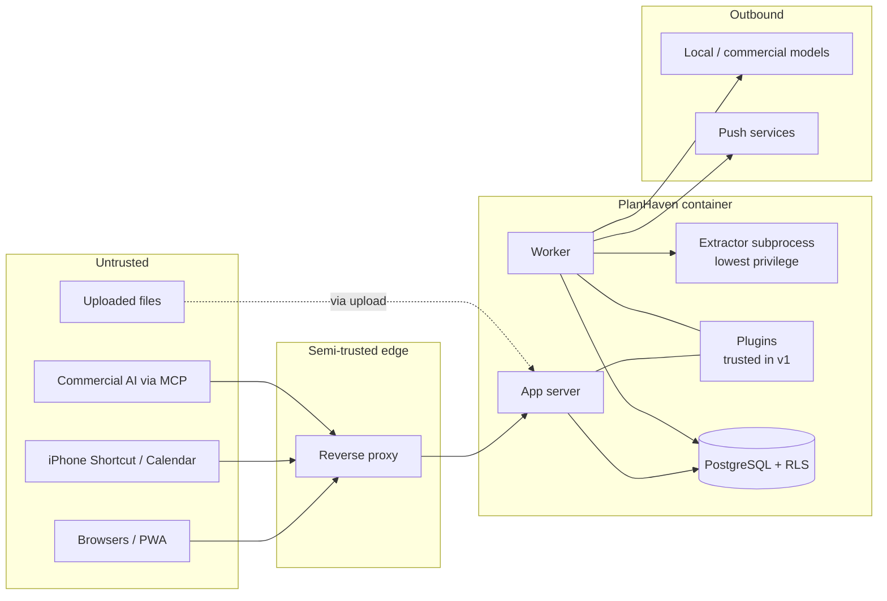

# PlanHaven — Security

> **Status:** Draft v0.1 · **Last updated:** 2026-09-26
> Companion to [`ARCHITECTURE.md`](ARCHITECTURE.md). Section references like "A§12" point there.

PlanHaven is designed to be exposed to the internet. This document is both the project's
security policy (how to report issues) and its security design: what we protect, from whom,
and how. Every release must meet the acceptance criteria in §11.

---

## 1. Reporting a vulnerability

**Please do not open public issues for security problems.**

Use GitHub's **private vulnerability reporting** on this repository
(Security tab → "Report a vulnerability"). Include affected version, steps to reproduce, and
impact. You'll get an acknowledgement as soon as possible; this is a personal project, so
response is best-effort, but security reports take priority over all other work.

| Version | Supported |
|---|---|
| Latest minor release | ✓ security fixes |
| `edge` (main) | best-effort |
| Older releases | ✗ — please upgrade |

Fixed issues are disclosed through GitHub Security Advisories with credit to the reporter
unless they prefer otherwise.

---

## 2. Scope and deployment assumptions

In scope: the PlanHaven container image, its web UI, API, MCP endpoint, OAuth server, ICS feeds,
sync endpoints, bundled plugins, the published Apple Shortcut, and the CI/release pipeline.

Assumed deployment:

- Runs on a trusted host (e.g. Unraid) that the operator controls.
- Internet traffic arrives through a reverse proxy that terminates TLS
  (Nginx Proxy Manager, SWAG, Traefik, or similar).
- Users are known people invited by the admin (household, family, friends). They are trusted
  not to attack the host, **but not trusted to see each other's unshared data.**

Out of scope: compromise of the Unraid host or Docker daemon itself, the operator's reverse
proxy software, users' own devices, and third-party AI providers' handling of data a user
chooses to send them.

---

## 3. Assets we protect

| Asset | Why it matters | Sensitivity |
|---|---|---|
| Account credentials, passkeys, TOTP secrets | Account takeover | Critical |
| Session cookies, API/sync/feed tokens, OAuth tokens | Impersonation | Critical |
| Master key, session signing key, VAPID private key | Decrypt secrets, forge sessions/push | Critical |
| AI provider API keys | Financial abuse, data exposure | High |
| Project content: notes, attachments, photos | House layout, security systems (camera/Frigate project), contracts, addresses, codes | High |
| Sharing relationships and membership | Cross-user data exposure | High |
| Audit log | Detection and accountability | Medium |
| Availability of the service | Daily use, reminders | Medium |

---

## 4. Threat actors

| Actor | Capability | Likely goals |
|---|---|---|
| Internet scanners / bots | Automated scanning, known-CVE exploitation, default-credential attempts | Foothold, crypto-mining, botnet |
| Credential stuffers | Large lists of leaked passwords | Account takeover |
| Targeted attacker | Manual testing of the app | Access a specific household's data |
| Malicious or compromised content | A document, web page, or AI response containing hostile instructions | Prompt injection: make an AI read or change data |
| Curious or careless user of the same instance | Valid account, can edit URLs and requests | See another user's unshared projects |
| Compromised dependency / supply chain | Malicious package or build step | Code execution in every installation |
| Stolen or lost phone | Holds sync token, PWA session, ICS URL | Read or alter lists and tasks |

---

## 5. Trust boundaries



Boundaries that must be enforced in code:

1. **Internet → app:** authentication, input validation, rate limiting, headers.
2. **User → user:** authorization in the service layer **and** RLS in the database.
3. **Content → AI:** content is data, never instructions; AI writes are scoped and audited.
4. **Uploaded file → parser:** parsing happens in a separate low-privilege subprocess.
5. **Plugin → core:** `PluginContext` only (advisory in v1; see §10).
6. **App → outbound network:** only admin-configured AI endpoints and allowlisted push hosts.

---

## 6. Threats and mitigations (summary)

Organized by STRIDE category. Details for each control are in §7.

| Threat | Category | Mitigations |
|---|---|---|
| Password guessing / credential stuffing | Spoofing | Mandatory 2FA, passkeys, Argon2id, breached/common password rejection, per-account and per-IP rate limits, progressive lockout, edge banning via fail2ban/CrowdSec (§7.1, §7.11) |
| Leaked password reset or invite link | Spoofing | Single use, short expiry (24 h / 72 h), token only in the URL fragment, hashed at rest, rate limited; a reset link still needs the account's second factor (§7.1) |
| Default or leftover admin credentials | Spoofing | No default credentials; one-time setup token printed to log at first boot (§7.1) |
| Session hijacking / fixation | Spoofing | HttpOnly+Secure+SameSite cookies, rotation on login and privilege change, server-side revocation (§7.2) |
| CSRF | Tampering | SameSite cookies + CSRF token on state-changing requests, `Origin` check (§7.2) |
| XSS | Tampering / Info disclosure | React escaping, sanitized Markdown, strict CSP with no inline script, uploaded HTML/SVG never rendered inline (§7.5, §7.10) |
| IDOR (reading another user's project by ID) | Info disclosure | Central authz layer + PostgreSQL RLS with `FORCE`; UUIDv7 IDs; automated cross-user test matrix (§7.4) |
| Token leakage (ICS URL, sync token) | Info disclosure | Narrow scopes, hashed storage, revocation, "titles only" feeds, identifiable prefixes for secret scanning (§7.3) |
| Malicious upload (parser exploit, zip bomb, polyglot) | Elevation / DoS | Byte-sniffed type allowlist, size limits, no auto-extract of archives, sandboxed extractor subprocess with rlimits and timeouts (§7.5, §7.6) |
| Prompt injection via documents or web content | Tampering / Info disclosure | Content delimited as data; AI acts only with the user's rights; no delete tools; propose-and-approve by default; scoped OAuth; `local_ai_only` projects hidden; audit + undo; features experimental until tested (§7.7) |
| Over-privileged AI connector | Elevation | Read vs. write scopes chosen at consent, per-client revocation, 2FA at consent (§7.3, §7.7) |
| SSRF via configurable URLs | Elevation / Info disclosure | AI endpoints admin-only; push hosts allowlisted; no user-supplied fetch URLs in core (§7.8) |
| Spoofed client IP via forwarded headers | Spoofing | Forwarded headers honoured only from `TRUSTED_PROXIES`; refuse to start in public mode without it (§7.11) |
| Secrets theft from DB dump or backup | Info disclosure | Secrets encrypted at rest with master key stored outside the DB (§7.9) |
| Container escape / host impact | Elevation | Non-root, dropped capabilities, `no-new-privileges`, read-only root FS where possible, DB on Unix socket only (§7.13) |
| Supply-chain compromise | Elevation | Hash-pinned deps, SHA-pinned Actions, scanning, signed images, SBOM, protected branches (§8) |
| Repudiation of changes (esp. by AI) | Repudiation | Append-only audit log with actor, client, IP (§7.12) |
| Resource exhaustion | DoS | Rate limits, body and upload limits, job concurrency limits, query limits (§7.11) |
| Cross-site WebSocket hijacking of the live-updates channel | Spoofing | Session or token required at handshake, `Origin` must equal `BASE_URL` (§7.15) |
| Stale access on a live connection after removal from a project | Elevation / Info disclosure | Sharing changes applied to open note connections at once (closed, or switched to read-only); every connection also re-checked every 15 s (§7.15) |
| Viewer or malicious client pushing edits or oversized/malformed updates | Tampering / DoS | Server rejects viewer updates; size, rate and document limits; malformed updates close the connection (§7.15) |
| Assignee (e.g. a child) seeing more than their chores | Info disclosure | Assignee access limited to their assigned tasks by authz and RLS; tested in the authz matrix (ADR 0013) |
| Private data left on a lost or shared phone (offline copies) | Info disclosure | No credentials, tokens or CSRF values stored; wiped on sign-out, when the session ends and when someone else signs in; device lock; revoke the device's session (§7.14) |
| Stale or tampered app served from the phone's cache | Tampering | Service worker is same-origin, revalidated on every load, caches only hashed app files and icons, never API data; CSP unchanged (§7.10) |
| Linking a project, quote or cost to something the user can't see (another person's asset or contact, another project's file or quote) | Info disclosure / Tampering | Links checked by the service and again by database triggers; hidden details stay hidden (A§7.1) |
| Proof photos exposing location or reaching the wrong people | Info disclosure | EXIF GPS stripped; visible only to assignee, assigner and project members (RLS) |
| Malicious plugin | Elevation | Admin-only install, no install-from-URL, permissions manifest, sandboxed UI iframes; backend isolation planned (§10) |

---

## 7. Security controls

### 7.1 Authentication

- **First boot:** no default account or password. A one-time setup token is printed to the
  container log; it expires after first use or 24 hours (a new one is printed on restart while
  no admin exists).
- **Registration:** disabled. Users join by single-use, expiring invite links created by an
  admin (default expiry 72 hours).
- **Forgotten password:** there is no email, so an admin makes a **password reset link**
  for that person (`/reset#phv_rst_...`): 256-bit token in the URL fragment, stored hashed,
  single use, 24 hours, a newer link cancels older ones, not for disabled accounts or the
  admin's own account. Using it sets the new password (policy checked first, so a weak
  password doesn't use up the link), signs out every device and notifies the user. The
  second factor is unchanged; a lost second factor is a separate admin reset.
- **Passwords:** minimum 12 characters, no composition rules, checked against a bundled list of
  common and breached passwords (offline; optional online k-anonymity check).
  Hashed with **Argon2id** at or above OWASP Password Storage Cheat Sheet minimums
  (currently m = 19 MiB, t = 2, p = 1; parameters stored per hash so they can be raised later).
- **Second factor is mandatory for every account.** Passkeys (WebAuthn) are preferred; TOTP is
  the fallback. Ten single-use recovery codes are issued at enrollment (stored hashed).
- **Passwordless:** a user with a passkey may sign in with the passkey alone (it is inherently
  multi-factor).
- **Step-up re-authentication** (fresh passkey or TOTP within the last 5 minutes) is required
  for: changing password or factors, creating tokens, approving an MCP client, changing sharing,
  exporting data, and all admin actions.
- **Account enumeration:** login, invite, and reset flows return identical responses and timing
  whether or not an account exists.
- **OIDC (optional):** admins may enable sign-in via an external provider (Authentik,
  Authelia, etc.). The local second-factor requirement can be delegated only if the provider
  asserts MFA (`amr`/`acr` claims).

### 7.2 Sessions and CSRF

- Server-side sessions; the cookie holds only a random identifier.
- Cookie: `__Host-` prefix, `HttpOnly`, `Secure`, `SameSite=Lax`, `Path=/`.
- Lifetimes: idle timeout 7 days, absolute 30 days (PWA convenience), both configurable.
  Session ID rotated on login and on privilege change.
- Users see active sessions (device, approximate location from IP, last used) and can revoke
  any or all. Password change revokes all other sessions.
- CSRF: synchronizer token for state-changing requests from the browser, plus `Origin` header
  verification against `BASE_URL`. Token-authenticated endpoints (sync, MCP) don't use cookies
  and are not CSRF-susceptible.

### 7.3 Tokens

All tokens are 256-bit random values, shown once, stored as SHA-256 hashes, revocable
individually, and carry an identifiable prefix so leaked tokens can be detected by secret
scanners (GitHub custom secret-scanning patterns are provided in `docs/`).

| Token | Prefix | Scope | Lifetime | Where it lives |
|---|---|---|---|---|
| Sync token (Shortcuts) | `phv_sync_` | Read lists/tasks mapped to Reminders; check off items | Until revoked; last-used shown | iPhone Shortcut |
| ICS feed token | `phv_ics_` | Read the user's calendar feed only | Until revoked / regenerated | Calendar subscription URL |
| Personal API token | `phv_pat_` | User-selected scopes | Max 1 year, expiry required | User scripts |
| OAuth access token (MCP) | `phv_oat_` | `projects:read` and/or `projects:write`, audience `/mcp` | 1 hour | AI provider |
| OAuth refresh token | `phv_ort_` | Obtain new access tokens | 30 days, rotated on use, reuse revokes family | AI provider |
| Invite | `phv_inv_` | Create one account | 72 hours, single use | Invite link |
| Setup token | `phv_setup_` | Create the first admin account | 24 hours or first use; replaced on every boot while no admin exists | Container log |

The ICS token must appear in a URL (calendar apps can't send headers); it is therefore
read-only, feed-only, and defaults to "titles only" content. Tokens are never logged.

### 7.4 Authorization

- **Single source of rules** in `backend/app/authz/`. Services call `authz.require(principal,
  action, resource)`; there is no other permission code path.
- **Row-Level Security** (A§8.3) enforces the same membership rules in PostgreSQL with
  `FORCE ROW LEVEL SECURITY`; the app's DB role doesn't own tables; missing user context
  returns zero rows.
- **Admins are not superusers of data.** Admin role manages users, settings, and plugins but
  cannot read other users' projects.
- **Not-found over forbidden:** requests for resources the principal can't read return `404`,
  so IDs can't be probed.
- **Authorization test matrix:** CI generates tests for every route × role (owner, editor,
  viewer, non-member, admin, each token type) and asserts the expected result. A new route
  without an entry in the matrix fails the build.

### 7.5 Input validation and uploads

- All request bodies validated by Pydantic models with explicit length and range limits;
  unknown fields rejected.
- Markdown rendered with a sanitizer allowlist (no raw HTML, no `javascript:` URLs); links get
  `rel="noopener noreferrer"`.
- Uploads:
  - Streamed with a hard size limit (`MAX_UPLOAD_MB`); request aborted when exceeded.
  - Type detected from file bytes; allowlist (images, PDF, Office documents, text, CSV,
    CAD/3D formats like STL/DXF, archives stored as opaque blobs).
  - Stored under a hash name outside any web-served path; original filename stored as data
    only and sanitized for `Content-Disposition`.
  - Always downloaded as attachments with `nosniff`; no inline rendering of HTML, SVG, or
    unknown types.
  - EXIF GPS stripped from images by default: images are decoded and re-encoded without
    metadata (colour profile kept) in a separate process that sets its own CPU, memory,
    file-size and open-file limits before reading input, with an empty environment, a
    30-second timeout, a 50-megapixel cap and only the JPEG, PNG, GIF and WebP decoders.
    It still runs as the app's user until the 0.5 extraction sandbox (§7.6). iPhone (HEIC)
    photos are first decoded to JPEG by libheif's separate command-line decoder (Debian
    package, decoder plugin only; the build fails if the GPL x265 encoder is present) under
    `prlimit` (CPU, memory, file size, open files, no core dumps) with an empty environment
    and a 30-second timeout, then cleaned like any other photo. Only these re-encoded images and
    their thumbnails are ever shown inline; everything else is a download.
  - Served files carry `Content-Security-Policy: default-src 'none'; sandbox`.
  - Archives never auto-extracted.
  - Asset and contact photos go through the same cleaning and are served the same way, to
    people who can see the asset or contact; only editors can change them.
  - Contact cards (.vcf) are read by PlanHaven's own small reader with limits (3 MB, 5,000
    lines, the first card only, known fields only); websites are kept only if http(s); an
    embedded photo is cleaned like any upload; a photo given as a link is never fetched.

### 7.6 Extraction sandbox

Document parsers are a historic source of exploits, so parsing never happens in the app or
worker process:

- The worker spawns a fresh extractor subprocess per file, running under a **separate UID**
  with no read access to `/config/secrets` or other blobs (the file is passed via stdin/pipe).
- Resource limits via `setrlimit`: CPU time, address space, file size, open files; wall-clock
  timeout enforced by the worker.
- Empty environment (no secrets or tokens inherited).
- Output is plain text + page metadata only, length-limited, validated before storage.
- **Limitation:** in v1 the subprocess shares the container's network namespace. Planned
  hardening: a dedicated extractor container with `network_mode: none` (see §10).

### 7.7 AI and prompt-injection defenses

Prompt injection can't be fully prevented, so the design limits what a hijacked AI could do:

- **Data, not instructions.** Retrieved chunks and attachment text are wrapped in delimited,
  labeled blocks and system prompts instruct models to treat them as untrusted content.
- **Least privilege for MCP.** No delete tools, no sharing or account tools, no raw file
  download. Read-only grants are offered at consent.
- **Privacy flag.** `local_ai_only` projects are invisible to MCP clients and cannot be sent to
  commercial providers; enforced in the provider layer.
- **Audit and undo.** Every AI-originated write is audited with client identity and can be
  reverted from the activity view.
- **Rate limits** per OAuth client on write tools.
- **AI changes follow the assistant rules (ADR 0012).** Local and commercial models act only
  through assistant tools that run as the signed-in user (`authz.require` + RLS), never with
  more rights. No delete, sharing, account or admin tools. Every change is attributed and
  undoable. The default mode is **propose and approve**: nothing is written until the user
  approves the change set. "Apply directly" is a per-feature option the admin may allow.
- **Experimental features are off by default.** Admin enables availability (step-up, audited),
  users opt in individually; a feature leaves experimental only with tests and a threat-model
  entry here.
- **Voice** (future): audio goes to an admin-configured local speech server; any service that
  sends audio off-site is a separate, clearly labelled opt-in.

### 7.8 Outbound requests and SSRF

- Core makes outbound requests only to (a) AI provider URLs configured by an admin and
  (b) Web Push endpoints on an allowlist of known push-service hosts over HTTPS.
- Users cannot supply URLs that the server fetches. (A future "import from URL" feature would
  require an SSRF-safe fetcher that blocks private, link-local, and metadata ranges after DNS
  resolution.)
- Outbound HTTP clients use timeouts, response size limits, and do not follow redirects to
  different hosts.

### 7.9 Secrets and cryptography

- Master key (256-bit) generated at first boot in `/config/secrets/master.key`, mode `0600`,
  never stored in the database or logs.
- AI provider keys, TOTP secrets, and OIDC client secrets are encrypted with **AES-256-GCM**
  using keys derived from the master key (per-purpose via HKDF). Ciphertexts carry a key ID to
  support rotation.
- A database dump alone therefore does not reveal these secrets.
- Only vetted primitives from the `cryptography` library; no custom crypto.
- Operators are told to back up `/config/secrets` separately and securely; without it,
  encrypted secrets can't be recovered (by design).

### 7.10 HTTP security headers

Set by the app itself (not dependent on proxy configuration):

```
Content-Security-Policy: default-src 'self'; script-src 'self';
  style-src 'self' 'sha256-38RhXrc7EdReTKsOm23ZPOCUgniTUUcjky8QOOrQx6o=';
  img-src 'self' data: blob:; font-src 'self'; connect-src 'self'; worker-src 'self';
  manifest-src 'self'; frame-src 'self'; frame-ancestors 'none'; base-uri 'none';
  form-action 'self'; object-src 'none'; upgrade-insecure-requests
Strict-Transport-Security: max-age=31536000; includeSubDomains
X-Content-Type-Options: nosniff
Referrer-Policy: strict-origin-when-cross-origin
Permissions-Policy: camera=(self), microphone=(), geolocation=(), payment=(), usb=()
Cross-Origin-Opener-Policy: same-origin
Cross-Origin-Resource-Policy: same-origin
```

- No inline scripts or styles; the frontend build must comply (CI checks for CSP violations
  during end-to-end tests). One exception, by exact hash: React Aria's fixed `touch-action`
  stylesheet (`'sha256-38RhXrc7EdReTKsOm23ZPOCUgniTUUcjky8QOOrQx6o='` in `style-src`). A hash
  allows only that exact text; the end-to-end test fails if it changes.
- `camera=(self)` allows photo capture into attachments from the PWA.
- The service worker (`/sw.js`, revalidated on every load) caches only the app itself:
  `index.html`, the hashed scripts and styles, and icons. It never caches API responses or
  files, and API paths are excluded from its offline fallback.
- Plugin UI routes use a stricter per-plugin CSP and are framed only by the app.
- `Server` and framework version headers are removed.

### 7.11 Rate limiting, proxy trust, and abuse

- Client IP taken from `X-Forwarded-For` **only** when the connecting peer is in
  `TRUSTED_PROXIES`; otherwise the peer address is used. In `PUBLIC_MODE` the app refuses to
  start without `TRUSTED_PROXIES` and an `https` `BASE_URL`.
- Rate limits (token bucket, stored in PostgreSQL/in-memory):
  login and 2FA per IP and per account; invite and OAuth registration per IP; MCP write tools
  per client; sync per token; uploads per user; AI questions per user.
- Lockout on failed logins: token buckets per IP (20, then 1 per 30 s), per account per IP (5,
  then 1 per minute; reset on success) and per account across all IPs (50, then 1 per minute),
  so an attacker elsewhere can't lock a real user out. Second-factor attempts: 10 per user,
  then 1 per minute, and 5 wrong codes end the session. Notification to the account owner
  follows with notifications (phase 0.3).
- Request body limits for JSON (1 MB default) separate from upload limits.
- `ADMIN_ALLOWED_CIDRS` can restrict the admin panel and admin API to LAN addresses.

### 7.12 Logging, audit, and detection

- Structured JSON logs with request IDs. Passwords, tokens, cookies, note bodies, and
  attachment contents are never logged (redaction filter + tests).
- **Security log** (`/config/logs/security.log`) with a stable, documented format for:
  failed/successful logins, 2FA failures, lockouts, token use from new IPs, permission
  denials, OAuth consent/revocation, admin actions. Parsers for **fail2ban** and **CrowdSec**
  are shipped in `deploy/`.
- **Audit log** (database, append-only for the app role): who did what, when, from where, via
  which client (UI, token, MCP client). Visible per project to members and globally to admins
  (metadata only, not content).
- Users are notified (push/in-app) of new sign-ins, new MCP client approvals, and token
  creation.

### 7.13 Container hardening

- Runs as non-root: `app` (PUID) and `postgres` users; s6-overlay drops privileges per service.
- Recommended runtime flags (in Unraid template "Extra Parameters" and compose file):
  `--cap-drop=ALL --cap-add=CHOWN --cap-add=SETUID --cap-add=SETGID --cap-add=DAC_OVERRIDE
  --cap-add=FOWNER --cap-add=KILL --security-opt=no-new-privileges:true --read-only
  --tmpfs /run:rw,exec,nosuid,size=64m --tmpfs /tmp:rw,noexec,nosuid,size=64m`.
  This minimal set was confirmed in CI: CHOWN/FOWNER/DAC_OVERRIDE let root prepare volume
  ownership and permissions, SETUID/SETGID drop privileges per service, and KILL lets s6 stop
  the non-root services cleanly (without it, shutdown ends in a forced kill). The image smoke
  test runs with exactly these flags.
- `/config` is root-owned (0711); the app writes only in its own subdirectories and
  PostgreSQL only in `/config/pgdata` (0700). The root startup step never recurses into
  volumes and refuses symlinks, so a compromised app can't redirect it.
- PostgreSQL accepts local connections only. The `postgres` superuser authenticates by peer;
  the app roles are reachable only by processes that can enter the socket directory
  (`/run/postgresql`, mode 0750, group PGID), i.e. the `postgres` and app users.
- Read-only root filesystem where compatible; writable paths limited to `/config`, `/data`,
  and a tmpfs for `/tmp` and `/run`.
- PostgreSQL listens on a Unix socket only; `listen_addresses = ''`.
- Minimal base image, no compilers or shells beyond what s6 requires in the final stage;
  multi-stage build.
- No SSH, no debug endpoints, no interactive consoles in production images.

### 7.14 Backups and data lifecycle

- Nightly database dumps in `/config/backups` inherit `/config` permissions (`0700`).
- Encrypted backups (user passphrase) planned.
- Soft-deleted content purged after 30 days; blobs removed when unreferenced.
- Offline copies on phones (A§13.4): the app keeps what you last saw of your projects,
  lists and open tasks, plus list changes made offline, in the browser's IndexedDB on that
  device. No passwords, session tokens or CSRF values are stored. It is wiped on sign-out
  and when a different person signs in. When the session simply runs out, the saved copies
  are wiped at once, but list changes not yet sent (item names and check-offs) are kept,
  marked with whose they are, until someone signs in: the same person sends them, anyone
  else causes them to be deleted. Device
  loss is covered by the phone's own lock and storage encryption; revoke the device's session
  from Account → Signed-in devices.
- Account deletion removes the user's owned projects (after transfer prompt) and all tokens,
  sessions, and factors.

### 7.15 Live updates and note saving (ADR 0011, ADR 0016)

- The live-updates WebSocket handshake requires a valid session cookie or a scoped token,
  and an `Origin` header equal to `BASE_URL`; anything else is refused before upgrading.
- Authorization (`authz.require`) is checked at connect and every 15 seconds; a sharing
  change closes the socket of a removed member at once. The socket only sends "something
  changed" notices (no content); pages then fetch through the normal API.
- Nothing sent by the browser over the socket is acted on. Limits: 20 open WebSockets per
  user, 1 MB per frame, compression off.
- Notes are saved on Done: one authenticated, CSRF-protected `PUT` with `If-Match`,
  editor role required, audited (`note.saved`). A stale version is refused (409), never
  merged or overwritten.
- The note document is untrusted input. The server rebuilds it from an allowlist of node
  types, marks and attributes; links may only be `http(s)` or `mailto` (others are dropped,
  keeping their text); limits: 4 MB stored, 50,000 nodes, depth 30, 200,000 characters.
  Anything else is refused (422).
- The note's Markdown copy (previews, search) is written by the server from the cleaned
  document; clients can't set it.
- Note contents are never logged.
- Ticking a note's checkbox from the project page: editor role required, checked against the
  item's text so a stale page can't tick the wrong line, and saved by the server.

---

## 8. Supply chain and security testing

**Repository** (see `docs/repo-setup.md`): protected `main` requiring pull requests (reviews
once there are two maintainers), status checks, signed commits, secret scanning with push
protection, Dependabot alerts, private vulnerability reporting, 2FA required for all
maintainers.

**Dependencies:** lockfiles with hashes (`uv`/`pip-tools` for Python, `package-lock.json` for
JS); automated update PRs; new dependencies reviewed for maintenance status and license.

**CI security jobs** (A§17):

| Tool | Purpose | Gate |
|---|---|---|
| CodeQL | Semantic code analysis (Python, JS/TS) | Block on high |
| Bandit, Semgrep | Python/JS security lint rules | Block on high |
| `pip-audit`, `npm audit` | Known-vulnerable dependencies | Block on high/critical |
| Gitleaks | Secrets in commits | Block |
| Trivy | Image OS and library CVEs, misconfig | Block on critical |
| OWASP ZAP baseline | Passive DAST against a test container | Block on high |
| Authz matrix tests | Cross-user access | Block on any failure |
| Header/CSP tests | Expected security headers present | Block |

**Release artifacts:** images signed with cosign (keyless, GitHub OIDC), SBOM (SPDX/CycloneDX)
attached, build provenance attestation. Verification instructions in the README.

**GitHub Actions hygiene:** third-party actions pinned to commit SHAs; `permissions:` default
`read-all` with per-job elevation; no `pull_request_target` with checkout of untrusted code.

---

## 9. Operator hardening guide

For whoever runs an instance:

1. **TLS at the proxy.** Use a valid certificate; redirect HTTP to HTTPS.
2. **Set `BASE_URL`** to the exact public `https://` URL and **`TRUSTED_PROXIES`** to the
   proxy's address or Docker network.
3. **Do not put forward-auth (Authelia/Authentik proxy auth) in front of PlanHaven.** It breaks
   the Shortcut, calendar feed, and MCP connector. Use PlanHaven's native auth, or its OIDC
   login if you want single sign-on.
4. **Proxy settings:** allow request bodies up to `MAX_UPLOAD_MB`; disable buffering and set
   long read timeouts for `/mcp`. Tested snippets are in `deploy/proxy/`.
5. **Ban at the edge:** enable the provided fail2ban jail or CrowdSec scenario against
   `/config/logs/security.log`.
6. **Restrict admin:** set `ADMIN_ALLOWED_CIDRS` to your LAN.
7. **Back up `/config/secrets` separately** and store it safely.
8. **Keep updated:** watch releases; verify image signatures if you like.
9. **Don't expose the container port directly** to the internet, only via the proxy.

---

## 10. Known limitations and accepted risks

| Risk | Why accepted (for now) | Planned mitigation |
|---|---|---|
| Plugins run in-process with full privileges | v1 plugins are first-party and admin-installed; isolation adds significant complexity | `PluginContext` boundary enables out-of-process plugins; signing/allowlist (A§14.8) |
| Extractor subprocess shares container network namespace | Separate container would break the single-image install | Optional dedicated extractor container with no network |
| ICS token appears in URL | Calendar clients can't send headers | Read-only, "titles only" default, easy regeneration |
| Sync token stored on iPhone in the Shortcut | Required by Shortcuts design | Narrow scope, revocation, last-used IP shown |
| Prompt injection can't be fully prevented | Inherent to LLMs | Least-privilege tools, audit + undo, `local_ai_only` |
| Data sent to commercial AI leaves your control | User's explicit choice per connection | Consent screen, per-project blocking |
| Bundled PostgreSQL shares container with app | Easier install | Unix socket only, separate OS user, RLS |
| Instance admin controls the host | Inherent to self-hosting | Admin can't read project data through the app; host access is out of scope |

---

## 11. Release security acceptance criteria

A release may be tagged only when all of the following hold:

- [ ] No default credentials; first-boot setup token flow works and expires.
- [ ] Mandatory 2FA enforced for every account; step-up enforced for sensitive actions.
- [ ] All CI security gates in §8 pass; no unresolved high/critical findings.
- [ ] Authz matrix covers every route and passes; RLS enabled and forced on every user-content
      table (verified by a test querying `pg_class`).
- [ ] Security headers and CSP present on all responses (automated test).
- [ ] `PUBLIC_MODE` refuses insecure configuration (automated test).
- [ ] No secrets, tokens, or content in logs (redaction tests).
- [ ] Rate limits active on auth, OAuth, sync, and upload endpoints (automated tests).
- [ ] Image runs as non-root with the documented capability set; Trivy clean of criticals.
- [ ] Image signed, SBOM attached, provenance published.
- [ ] Backup and restore smoke test passes.
- [ ] New features have a threat-model entry in this document (or explicitly none needed,
      noted in the PR).
