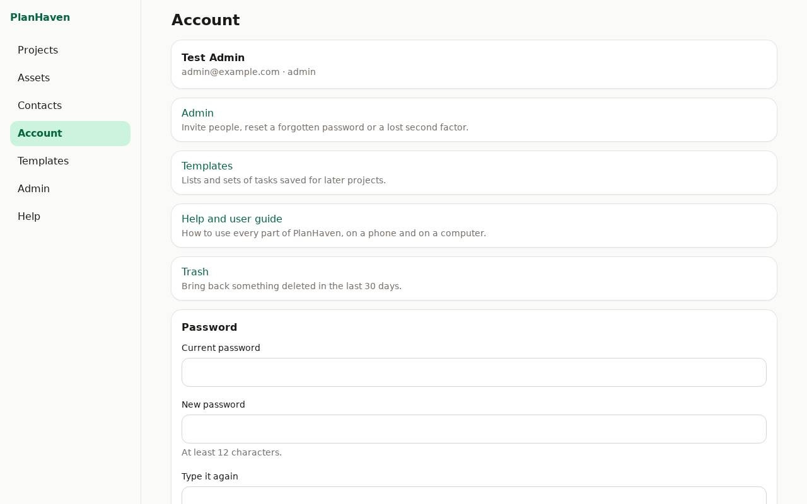

# Your account and security

Open **Account**.

## Passkeys and recovery codes

- **Add a passkey on this device**: sign in with Face ID, Touch ID or a fingerprint here.
- **Remove** a passkey you no longer use.
- **New recovery codes**: makes a fresh set (the old ones stop working). Save them, then tap **I've saved them**.

## Password

**Change password**: enter the **Current password**, then the **New password** twice.

## Signed-in devices

See where you're signed in. **Sign out** one device, or **Sign out all other devices** if a
phone was lost.

## Experimental features

When an admin has made experimental features available, they're listed here with what they do
and their known risks. Tick one to try it; untick it to stop. Only you are affected, and
anything experimental is marked **Experimental**.

## Signing out

- **On a phone:** **Sign out** is at the right end of the menu at the bottom.
- **On a computer:** **Sign out** is at the bottom of the menu on the left.
