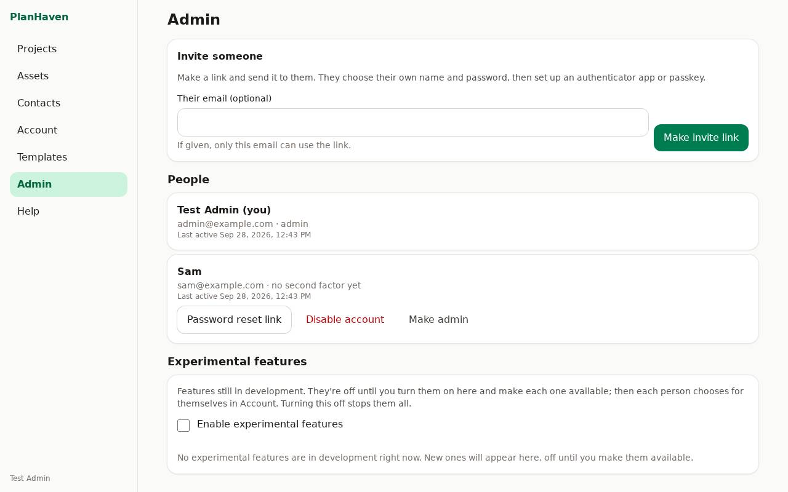
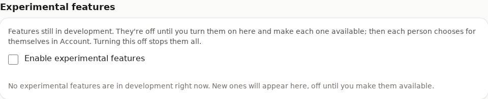

# Admin

Only admins see **Admin** in the menu. Admins manage accounts; they can't see other people's
projects unless those are shared with them.

## Invite someone

1. Tap **Invite someone**, optionally enter **Their email (optional)**, then **Make invite link**.
2. **Copy link** (or **Share…**) and send it to them. Anyone with the link can join, so send it privately.
3. They open it and create their account (see [Getting started](getting-started.md)).

## When someone is locked out

On their card under **People**:

- **Password reset link**: make a link and send it to them; they choose a new password.
- **Reset second factor**: if they lost their phone and their recovery codes; they set up a new one at their next sign-in.

## Experimental features

Features still in development (none right now). Nothing experimental reaches anyone until:

1. you tick **Enable experimental features**;
2. you make each feature available (it's listed with what it does and its known risks);
3. each person turns it on for themselves in **Account**.

Untick **Enable experimental features** to stop them all at once.

## Other actions

- **Make admin** / **Remove admin**.
- **Disable account** (tap twice): they can't sign in any more; **Enable account** undoes it.
