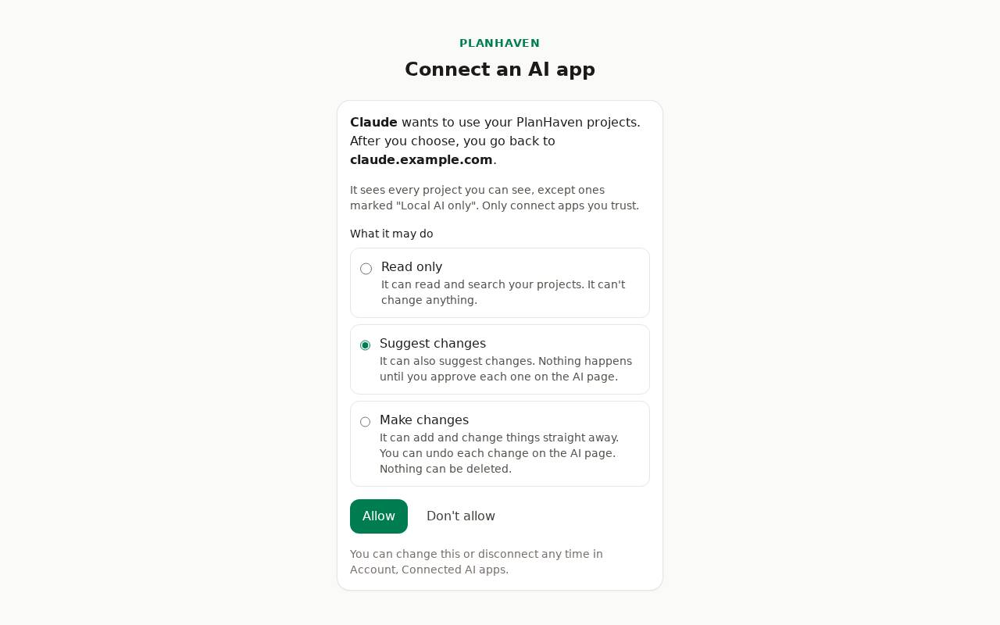
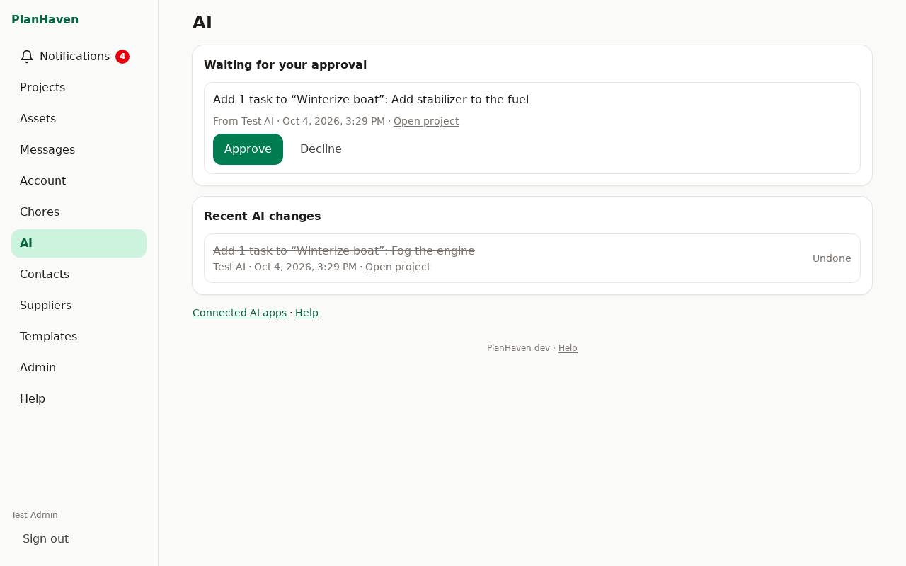
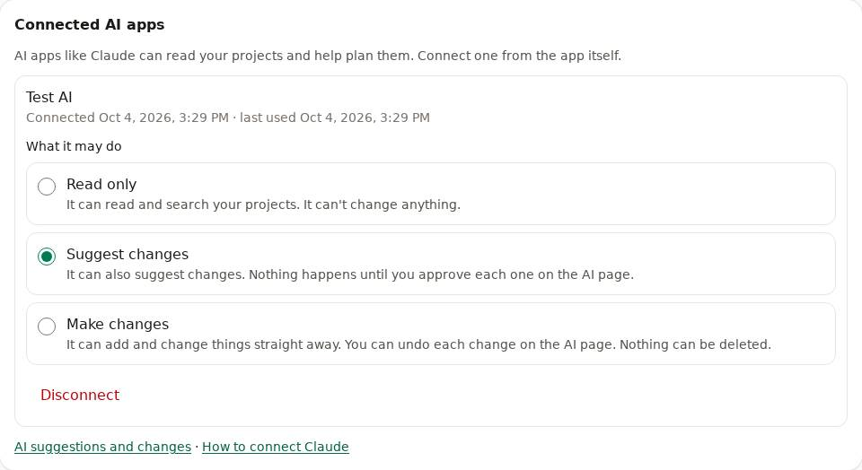

# AI apps (Claude and others)

Connect an AI app such as Claude to PlanHaven. It can then read your projects, answer questions
about them and help you plan: "what's left on the boat?", "make a parts list for the brake job".
If you allow it, it can also add tasks, notes and list items for you.

You choose what each app may do:

- **Read only**: it reads and searches your projects. It can't change anything.
- **Suggest changes**: it can also suggest changes. Nothing happens until you approve each one.
- **Make changes**: changes happen straight away, and you can undo each one.

An AI app can never delete anything. It sees every project you can see, except projects marked
**Local AI only**. Only connect apps you trust.

## Connect Claude

You need the address of your PlanHaven, for example `https://planhaven.example.com`.

**On a computer (claude.ai or the Claude app)**
1. In Claude, open **Settings**, then **Connectors**.
2. Click **Add custom connector**.
3. Name it **PlanHaven**. In the address box, type your PlanHaven address followed by `/mcp`,
   for example `https://planhaven.example.com/mcp`. Click **Add**.
4. Click **Connect**. PlanHaven opens; sign in if it asks.
5. Choose what Claude may do, then click **Allow**. Confirm it's you with your second factor.
6. You're back in Claude. In a chat, turn PlanHaven on under the tools (search and tools) button.

**On a phone**: add the connector on a computer first (steps above). It then works in the Claude
app on your phone too.

Other AI apps that support "MCP" connectors work the same way: give them the `/mcp` address.

## Approve suggested changes

When an app set to **Suggest changes** wants to change something, you get a notification.

1. Open **AI** (in the menu on a computer; on a phone, tap the notification, or open **Account**
   and tap **AI suggestions and changes**).
2. Under **Waiting for your approval**, read each change.
3. Tap **Approve** or **Decline**. **Approve all** does them all at once.

If something changed since the suggestion was made (the task was deleted, say), approving it
sets it aside instead.

## Undo an AI change

Under **Recent AI changes** on the **AI** page, tap **Undo** next to a change. Tasks, notes and
items it added are moved to the Trash; a project it changed goes back to how it was; a task it
ticked is unticked.

## Change or disconnect an app

1. Open **Account**, then go to **Connected AI apps**.
2. Pick a different choice under the app's name to change what it may do. Allowing more
   (changes, or making changes without asking) asks for your second factor.
3. Tap **Disconnect** to stop it at once. To use it again, connect it again from the app.

## Keep a project away from AI apps

The project's owner can open it, scroll to the bottom and tick **Local AI only**. AI apps then
can't see it at all.

## Good to know

- Each person connects their own apps. An app sees only what that person can see, and can only
  change what that person can change.
- Text in your projects is shown to the app as your content, not as instructions to it.
- Choose when you're told about suggestions in **Account**, under **Notifications** ("AI apps").
