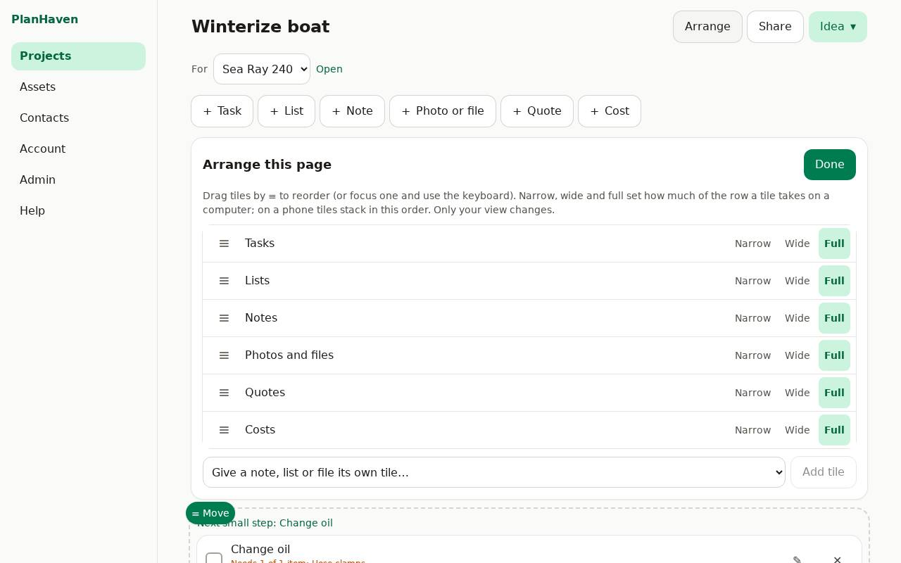

# Arranging a project page

A project page is made of tiles: **Tasks, Lists, Notes, Photos and files, Quotes, Costs**, and
any single note, list or photo you give its own tile. You decide the order and the size.

Each project is arranged on its own, and each person has their own arrangement. People you
share a project with see your arrangement until they change theirs.

## Start arranging

Tap **Arrange** at the top of the project. The page shows a **≡ Move** handle on every tile, and
on every note, list and photo inside the groups. The **Arrange this page** panel opens at the top.

## Move things by dragging

- Drag a tile (or a note, list or photo out of its group) and drop it on another tile:
  - on its **top half** to put it **before** that tile,
  - on its **bottom half** to put it **after** it.
- A note, list or photo dropped on its own group (**Notes**, **Lists**, **Photos and files**) goes back into it.

### On a phone

Press and hold a tile (or a note, list or photo), then drag it. Tiles always stack one under
the other, in your order; the sizes below only matter on a computer.

### On a computer

Drag with the mouse. Tiles sit beside each other when they fit (see sizes below).

Tasks, quotes and costs always stay grouped, and a list's items always stay in their list.

## Size: Narrow, Wide, Full

In the **Arrange this page** panel, each tile has **Narrow**, **Wide** and **Full**. On a
computer the page is three narrow tiles wide: a **Wide** note and a **Narrow** photo sit side
by side.

## The panel (also works with the keyboard)

- Drag the rows to reorder, or focus one and use the keyboard.
- **Give a note, list or file its own tile**: pick one and tap **Add tile**. It goes to the top.
- **Put back**: returns a single note, list or file to its group.
- **Go back to the shared arrangement**: forget your own arrangement of this project.

Tap **Done** when finished. Changes are saved as you make them.
