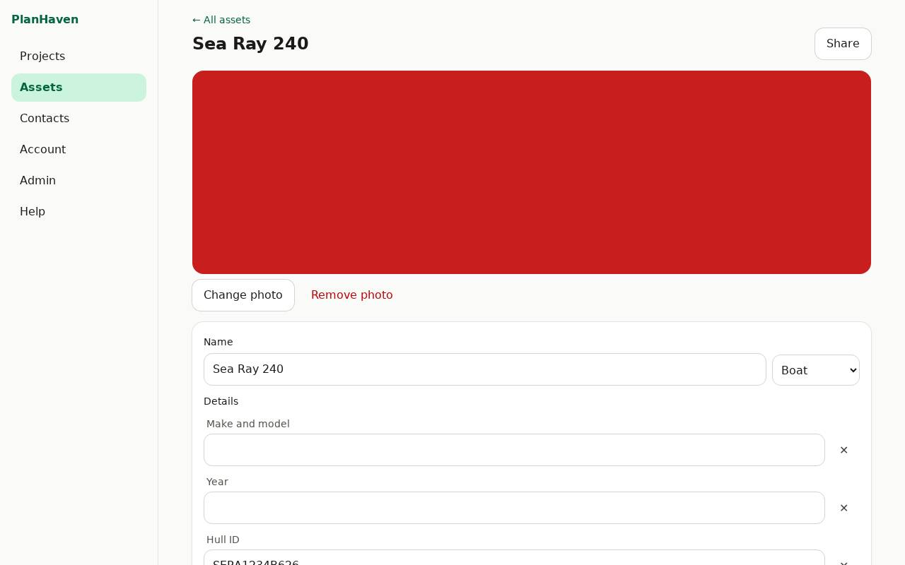

# Assets

The things your projects are about: a vehicle, a boat, the house, equipment. Each keeps its own
details and service history.

## Add an asset

1. On **Assets**, type the name in **New asset**, choose its **Kind**, tap **Add asset**.
2. On its page, fill in the details (they depend on the kind: plate, mileage, hull ID,
   engine hours, serial number, ...) and **Notes**, then **Save**.
3. **Add a photo**: it shows on the asset's card.

## Service history

Link projects to the asset (on the project, with the asset picker under the title). The
asset's page lists them: everything done to it, in one place.

## Share and delete

**Share** works like for projects (see [Sharing](sharing.md)). **Delete asset** (tap twice)
sends it to the [Trash](trash.md).
