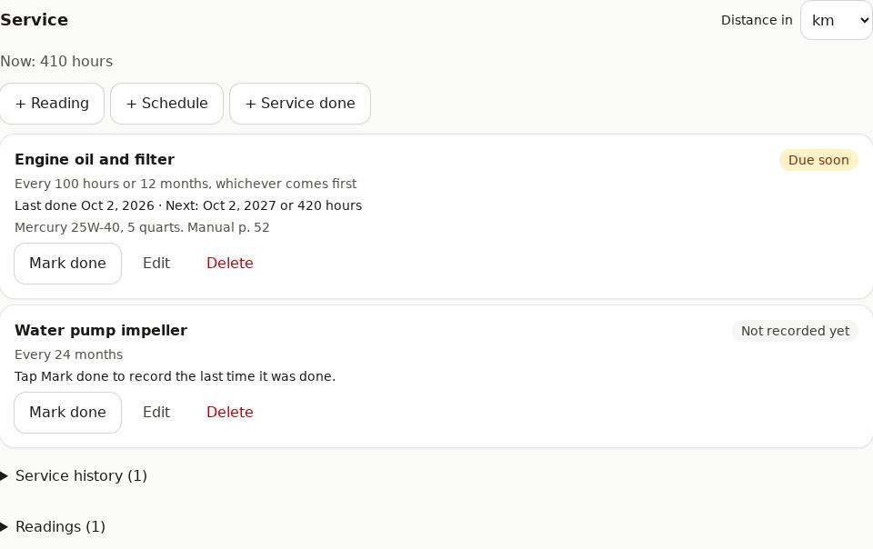

# Assets

The things your projects are about: a vehicle, a boat, the house, equipment. Each keeps its own
details and service history.

## Add an asset

1. On **Assets**, type the name in **New asset**, choose its **Kind**, tap **Add asset**.
2. On its page, fill in the details (they depend on the kind: plate, mileage, hull ID,
   engine hours, serial number, ...) and **Notes**, then **Save**.
3. **Add a photo**: it shows on the asset's card.

## Service: readings and maintenance schedules

Keep up with the manufacturer's maintenance schedule (the owner's manual): PlanHaven shows what's
**Overdue**, **Due soon** or **OK**.

1. **Distance in**: choose km or miles for this asset.
2. **+ Reading**: the odometer and/or the hour meter, with the date. Add one now and then (or
   when you fill up); the highest reading counts.
3. **+ Schedule**: what to do (for example "Engine oil and filter") and how often: every so many
   km (or miles), hours, and/or months. With more than one, whichever comes first.
4. **Mark done** on a schedule when it's been done: the date, the odometer or hours (filled in
   from the last reading), the cost and notes. A new schedule says **Not recorded yet** until you
   record the last time it was done.
5. **+ Service done** records anything else (a repair, a part replaced).

It's **Due soon** in the last 30 days, or the last tenth of the distance or hours (for oil every
100 hours: from 90 hours after the last change). **Service history** and **Readings** list
everything recorded; ✕ deletes one.

Viewers see all of it; owners and editors of the asset can change it.

## Projects for the asset

Link projects to the asset (on the project, with the asset picker under the title). The
asset's page lists them, for bigger jobs with their own tasks and costs.

## Share and delete

**Share** works like for projects (see [Sharing](sharing.md)). **Delete asset** (tap twice)
sends it to the [Trash](trash.md).
