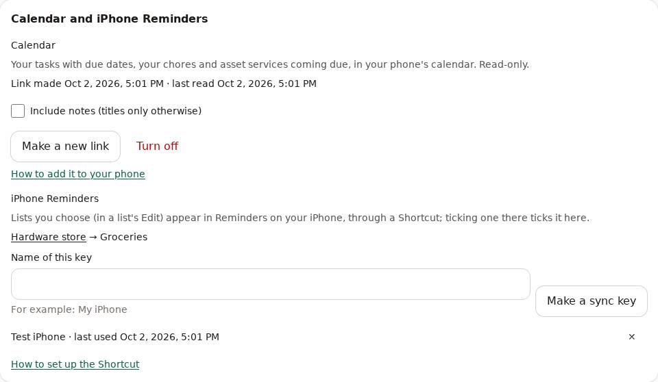

# Calendar and iPhone Reminders

See your due dates in your phone's calendar, and send shopping lists to Reminders on your iPhone.
Both are set up in **Account**, under **Calendar and iPhone Reminders**.

## Calendar

The calendar shows:

- your tasks with a due date (in projects you can change), and chores given to you;
- asset services coming due (see [Assets](assets.md)).

It's read-only: change things in PlanHaven, and the calendar follows (phones check every hour or so).

1. In **Account**, tap **Make my calendar link** (and confirm it's you).
2. Tap **Copy**. The link is shown only this once.
3. Add it to your calendar app:

**On an iPhone**
1. Open **Settings**, then **Apps**, then **Calendar** (on older iPhones: **Settings**, then **Calendar**).
2. Tap **Calendar Accounts**, then **Add Account**, then **Other**.
3. Tap **Add Subscribed Calendar**, paste the link in **Server**, tap **Next**, then **Save**.

**On Android (Google Calendar)**: Google Calendar on a phone can't add a link. On a computer, open
calendar.google.com, click **+** next to **Other calendars**, then **From URL**, paste the link and
click **Add calendar**. It then shows on your phone too.

**On a computer**: in Outlook, **Add calendar**, then **Subscribe from web**; on a Mac, in the
Calendar app, **File**, then **New Calendar Subscription**.

### Keep it private

Anyone with the link can read the calendar, so don't share it. It shows titles only (task, project
and asset names); tick **Include notes** to add the tasks' notes. If the link leaks, tap **Make a
new link** (the old one stops working; add the new one to your phone) or **Turn off**.

## iPhone Reminders

Lists you choose show in Reminders on your iPhone. Tick one there, and it's ticked in PlanHaven;
add or tick one in PlanHaven, and Reminders follows the next time the Shortcut runs. Apple only
lets Shortcuts change Reminders, so you build one small Shortcut, once.

### 1. Choose the lists

1. In the **Reminders** app, make a list for it, for example **Groceries**.
2. In PlanHaven, open the list, tap **Edit**, and under **iPhone Reminders** type the same name in
   **Reminders list**. Tap **Send to Reminders**.

Several PlanHaven lists can go to the same Reminders list.

### 2. Make a sync key

In **Account**, under **iPhone Reminders**, give the key a name (for example "My iPhone") and tap
**Make a sync key**, then **Copy**. It's shown only this once: keep it in the Shortcut, nowhere else.

### 3. Build the Shortcut

In the **Shortcuts** app, tap **+** and name it **PlanHaven sync**. Add these actions in order
(search for each name at the bottom). Where it says **your address**, use your PlanHaven's address,
like `https://planhaven.example.com`.

**The key**
1. **Text**: paste your sync key. Tap the result and **Rename** it to **Key**.

**Send what you ticked on the phone**
2. **Find Reminders**: tap **Add Filter**: **List** is **Groceries**; add **Is Completed** is
   on, and **Notes** contains `/i/`.
3. **Get Details of Reminders**: **Notes** of the reminders.
4. **Combine Text**: the notes, with **New Lines**.
5. **Get Contents of URL**: `your address/api/v1/sync/push`. Tap **Show More**:
   - **Method**: **POST**.
   - **Headers**: add **Authorization** with the value `Bearer ` (with a space) followed by the
     **Key** variable.
   - **Request Body**: **JSON**; add a **Text** field named `done_text` with the **Combined Text**.

**Bring the list from PlanHaven**
6. **Get Contents of URL**: `your address/api/v1/sync/pull?list=Groceries`, with the same
   **Authorization** header (method **GET**).
7. **Get Dictionary Value**: **Value** for `items`.
8. **Repeat with Each** item. Inside it:
   1. **Get Dictionary Value**: `id` in **Repeat Item**. Rename it **ID**.
   2. **Find Reminders**: **List** is **Groceries** and **Notes** contains **ID**; **Limit** 1.
      Rename it **Found**.
   3. **Get Dictionary Value**: `action` in **Repeat Item**.
   4. **If** the **Dictionary Value** is `remove`:
      - **Remove Reminders**: **Found** (turn off **Confirm Before Deleting** if it's shown).
   5. **Otherwise**: **If** **Found** does not have any value:
      - **Get Dictionary Value**: `title` in **Repeat Item**, and another for `url`.
      - **Add New Reminder**: the **title**, in **Groceries**; tap **Show More** and put the
        **url** in **Notes**.
   6. **End If** (both).
9. **End Repeat**.

For a second Reminders list, copy steps 2 to 9 and change **Groceries** in steps 2, 6, 8.2 and
8.5.

Tap **Done**, then run it once with the **▶** button. Allow it to use Reminders and to connect
to your PlanHaven when asked. The items appear in Reminders, each with a link back to PlanHaven in
its notes.

### 4. Run it by itself

In **Shortcuts**, **Automation**, tap **+**:
- **App**, choose **Reminders**, **Is Closed**, **Run Immediately**, then **PlanHaven sync**: it
  syncs each time you leave Reminders.
- Add another with **Time of Day** (for example 7:00 and 17:00) for the other direction.

### If it doesn't work

- **401**: the key was removed or mistyped; make a new one in **Account**.
- Nothing appears: check that the Reminders list name in PlanHaven matches exactly, and that
  the list was sent (**Account** shows **Lists sent to Reminders**).
- Remove a key you no longer use with ✕ in **Account**; that phone stops syncing at once.

A sync key can only read the lists you chose and tick their items; it can't open anything else.
