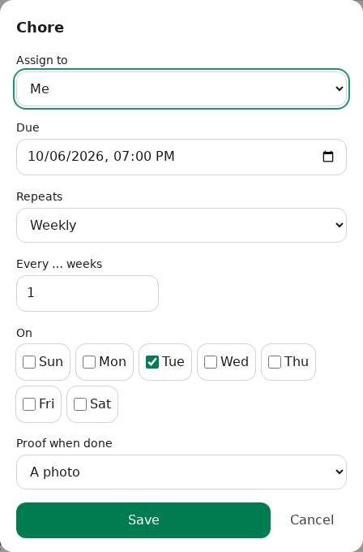
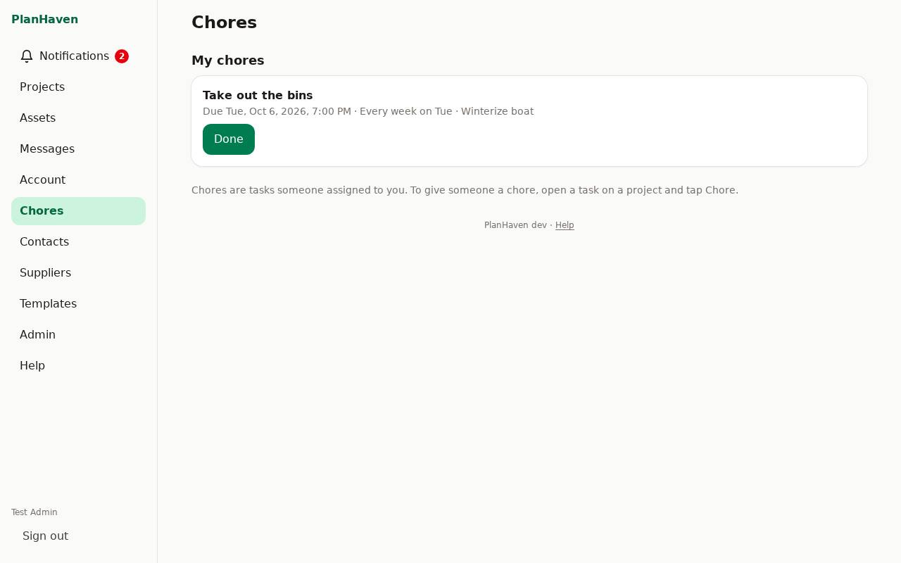

# Chores

Give a task to someone in your household, once or on a repeat, with a reminder when it's due.
Ask for proof if you like (a photo or a note) and approve it, or send it back.

## Give someone a chore

1. On a project, tap the task (or add one with **+ Task**).
2. Tap **Chore**.
3. **Assign to**: anyone on your PlanHaven (or **Me**).
4. **Due**: the date and time.
5. **Repeats**: **Never (once)**, **Daily**, **Weekly** (tick the days, for example **Tue**) or
   **Monthly**, and how often (every 1 week, every 2 weeks, ...).
6. **Proof when done**: **No proof needed**, **A photo** or **A short note**.
7. Tap **Save**. They get an alert; the task shows "Chore for Sam" on the project.

To stop, open the chore and set **Assign to** to **Nobody (not a chore)**.

## Someone who isn't in the project

A chore can go to anyone on your PlanHaven, even someone the project isn't shared with (a
child, for instance). They see only their chore (its name, notes and when it's due), not the
rest of the project.

## Doing a chore

Your chores are under **Chores**: on **Projects** (at the top, when you have some), or in the
menu on a computer.

1. Tap **Done**.
2. If a photo is asked for: **Take photo** (on a phone) or **Choose a photo**. Its location
   is removed. If a note is asked for: write it and tap **Send**.
3. It says **Done, waiting for approval** until the person who gave it to you checks it.

A repeating chore moves on to its next time once it's done (and approved).

## Reminders

You get an alert when a chore is due, and one more a few hours later if it's still not done.
Choose how in **Account** under **Notifications** (**Chores: assigned, due, to approve**).

## Approving

When someone finishes a chore you gave them with proof, you get an alert, and it's under
**Chores**, **To approve**, with their photo or note.

- **Approve**: it's done (or moves on to its next time).
- **Send back**: say what still needs doing; they see it on the chore and do it again.

The project's owners and editors can approve too.
