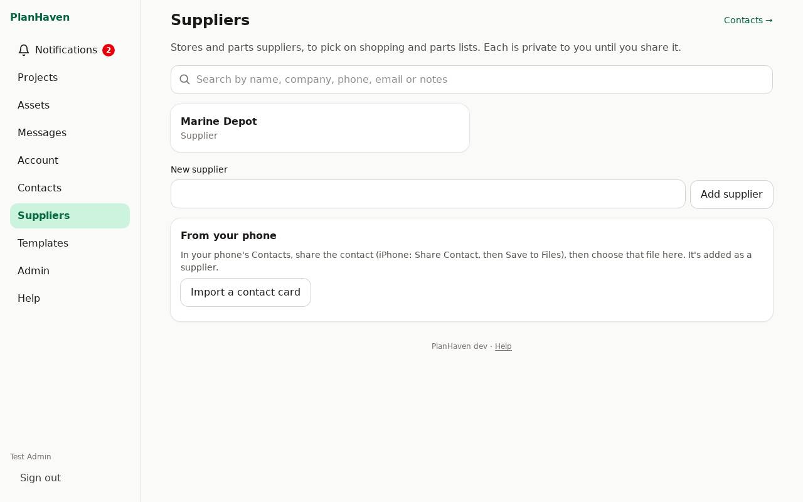
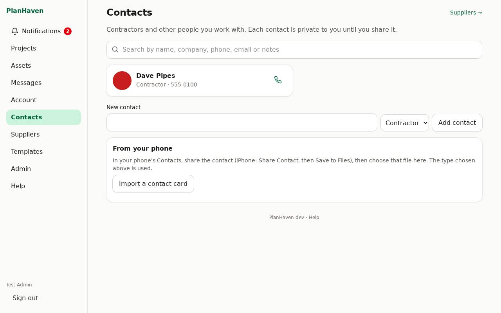
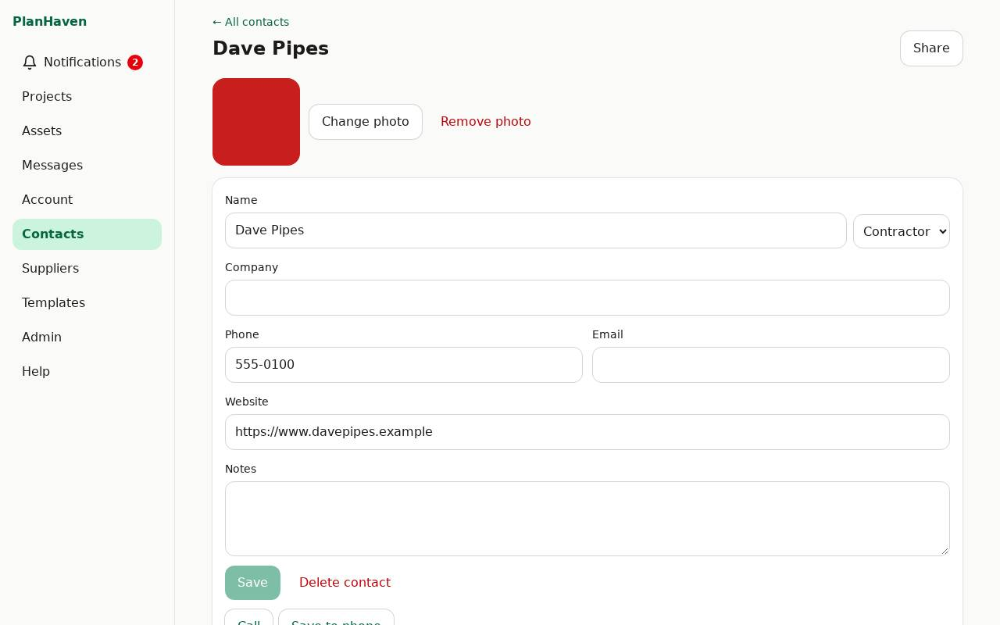

# Contacts and suppliers

Contractors and anyone you deal with are in **Contacts**; stores and parts suppliers have their
own list, **Suppliers**. Each one is **private to you** until you share it.

## Suppliers

- **On a computer**: **Suppliers** in the menu.
- **On a phone**: on **Account**, tap **Contacts**, then **Suppliers →** at the top (or the **Suppliers** link on **Account**).

Add one with **New supplier** and **Add supplier**, or straight from a shopping or parts list
item (see [Lists](lists.md)). A supplier's page works like a contact's: phone, email, website,
notes, sharing.

## Add a contact

1. On **Contacts**, type the name in **New contact**, choose the type (Contractor or Other), tap **Add contact**.
2. Fill in company, phone, email, website and notes, then tap **Save**.
   A website can be typed as `www.example.com`; `https://` is added for you.

## From your phone

**iPhone:**
1. In the Contacts app, open the person, tap **Share Contact**, then **Save to Files**.
2. In PlanHaven, on **Contacts** (or **Suppliers**), choose the type next to **New contact**.
3. Under **From your phone**, tap **Import a contact card** and pick the file you saved.

**Android:** share the contact as a file (.vcf) the same way, or tap **Pick from phone
contacts** to choose one straight from your phone (Chrome).

The name, company, phone, email, website, notes and photo come along (the photo is cleaned
like any upload).

## To your phone

On the contact's page tap **Save to phone**. Your phone downloads a contact card; open it to add
the person to your phone's contacts (with their photo).

## Photo

On the contact's page tap **Add a photo** (iPhone photos work; location is removed).
**Change photo** or **Remove photo** later.

## Call, email, search

- The phone and envelope buttons on each contact card call or email them.
- The search box at the top of **Contacts** finds them by name, company, phone, email or notes.

## Their quotes

A contact's page lists the quotes from them on your projects. To add one, see
[Quotes, costs and purchases](quotes-and-costs.md).

## Share a contact

On the contact's page tap **Share**, then add someone (see [Sharing](sharing.md)).
