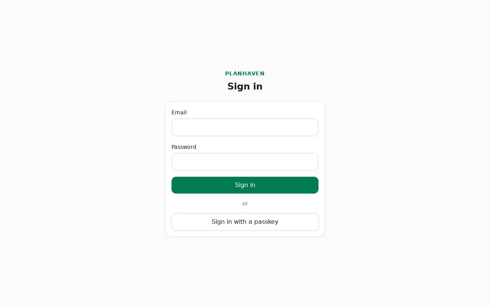
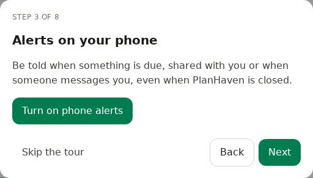
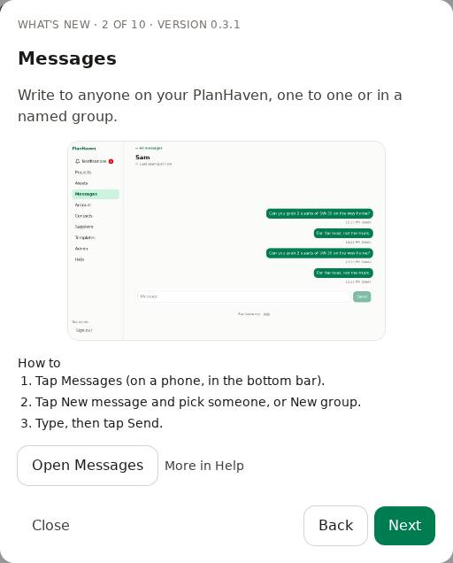

# Getting started

## The very first sign-in (the admin)

When PlanHaven starts for the first time, it has no accounts yet.

1. Open the container's log and find the line with the one-time **setup token** (it starts with `phv_setup_`).
2. Open PlanHaven in your browser. You'll see **Welcome! Create the admin account**.
3. Paste the setup token, enter your name, email and a password, and tap **Create admin account**.
4. Protect your account with a second factor (see below).

## Joining with an invite

An admin sends you an invite link (see [Admin](admin.md)).

1. Open the link. You'll see **Join PlanHaven**.
2. Enter **Your name**, your **Email** and **Choose a password**.
3. Tap **Create my account**, then protect your account (below).

## Your second factor (required)

PlanHaven is on the internet, so every account needs a second factor besides the password.
On **Protect your account**, choose one:

- **A passkey** (Face ID, Touch ID, fingerprint or a security key): the simplest.
- **An authenticator app** (like Google Authenticator or 1Password): scan the code, then **Enter the 6-digit code it shows**.

Then **Save your recovery codes**: each works once if you lose your phone. Copy them somewhere
safe (a password manager), then tap **I've saved them**.

## Signing in

1. Enter your email and password, tap **Sign in**.
2. Confirm with your passkey, or the 6-digit code from your authenticator app. No phone? Choose **Use a recovery code**.

## The welcome tour

The first time you sign in, a short tour shows the basics, one step at a time: putting
PlanHaven on your phone, turning on alerts, starting a project, messages, and where Help is
(admins also get inviting people and keeping things safe). Where you can set something up,
there's a button to do it right there. **Next** and **Back** move through it; **Skip the tour**
closes it.

## What's new

After an update, the first time you open PlanHaven it shows what's new: every update since you
last looked, together. Each new feature has a few words, a short how-to, and where it needs
setting up, a button to do it then and there. **More in Help** opens its page of this guide.

Both are in **Help** any time: **Take the tour again** and **What's new**.

## Finding your way around

### On a phone

The menu is at the bottom: **Projects**, **Assets**, [Messages](messages.md), **Account** and the bell for [Notifications](notifications.md). **Contacts** and **Suppliers** are on **Account**, and **Sign out** is at the bottom of it.
**Help** is at the bottom of every page, and on **Account** (with **Templates**).

### On a computer

The menu is on the left: **Notifications** (with the unread number), **Projects**, **Assets**,
**Messages**, **Account**, **Contacts**, **Suppliers**, **Templates**,
**Admin** (admins only), **Help**, and **Sign out** at the bottom.

## PlanHaven on your phone

PlanHaven works in the browser and can be added to your home screen like an app.

- **iPhone (Safari):** tap the Share button, then **Add to Home Screen**.
- **Android (Chrome):** tap the ⋮ menu, then **Install app** or **Add to Home screen**.

Lists keep working without signal (see [Lists](lists.md)).

## Which version am I using?

The version is shown at the bottom of every page (for example "PlanHaven v0.2.12"). After an
update, the app picks up the new version by itself; if it doesn't, close and reopen it.
