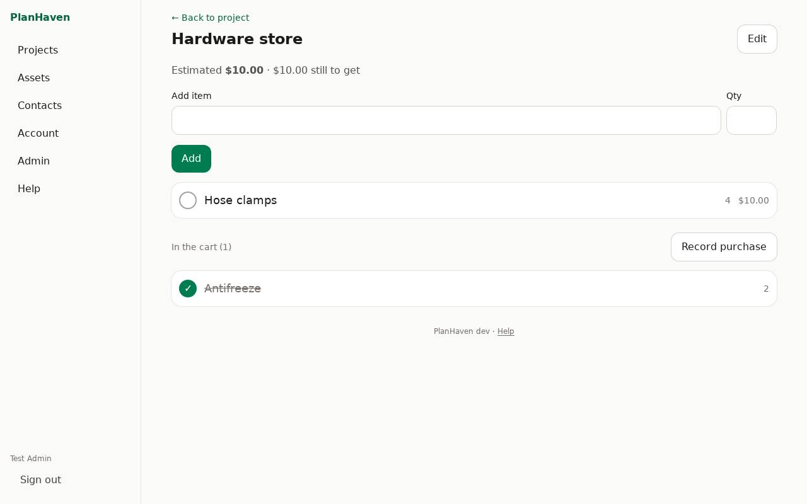
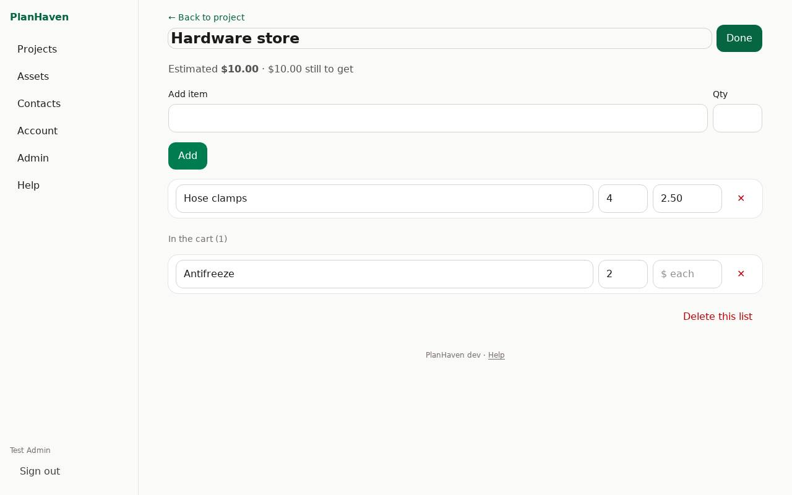

# Lists

Three kinds: **Shopping**, **Parts** and **Checklist**. Made for a phone in one hand in a store.

## Make a list

1. On the project, tap **+ List**.
2. Type its name in **New list**, choose the type, tap **Add list**.
3. Tap the list's card to open it.

## Add and check off items

1. Type in **Add item**, optionally a **Qty**, tap **Add**.
2. Tap an item to check it off; it moves to **In the cart**. Tap again to undo.

## Suggestions while typing

When you type an item you've added before (on any list you can see), PlanHaven suggests it
under **Add item**: tap the suggestion to fill in the name, the quantity and (on shopping and
parts lists) the price you gave it last time. **Price each** shows under the box.

## Edit mode

Tap **Edit** at the top of the list:

- Change an item's name, quantity or **price each** (shopping and parts lists). Changes are saved when you leave the box.
- Rename the list in **List name**.
- Delete an item with ✕, and tap **Undo** within a few seconds if that was a mistake.
- **Delete this list** (tap twice). It goes to the [Trash](trash.md).

Tap **Done** to leave edit mode.

## Estimated prices

Give items a **price each** in edit mode. The list then shows **Estimated** (price × quantity)
and how much is **still to get**. The project's list card shows it too, and the estimates count
in the project's budget (see [Quotes, costs and purchases](quotes-and-costs.md)).

## No signal in the store

A list you've opened on your phone before keeps working offline: you can add items and check
them off. They show **not sent yet** and are sent by themselves when you're back online. If
someone changed or deleted the same item meanwhile, PlanHaven tells you which change couldn't
be saved.

## Record a purchase

After shopping, with items checked off in **In the cart**:

1. Tap **Record purchase**.
2. A purchase is created with those items and their estimated prices, and opens.
3. Add the store, the receipt and what you actually paid. See [Quotes, costs and purchases](quotes-and-costs.md).
