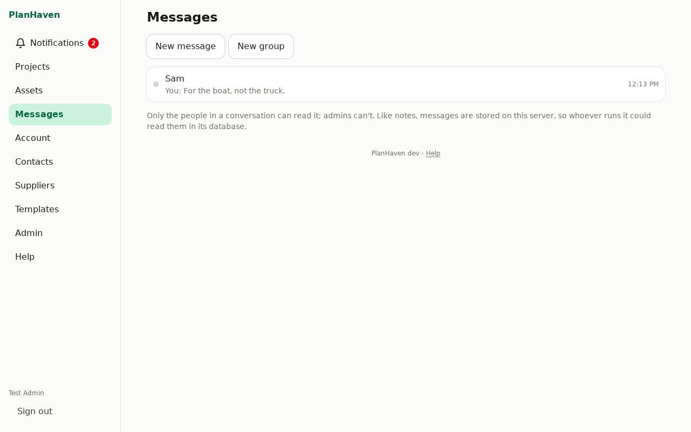
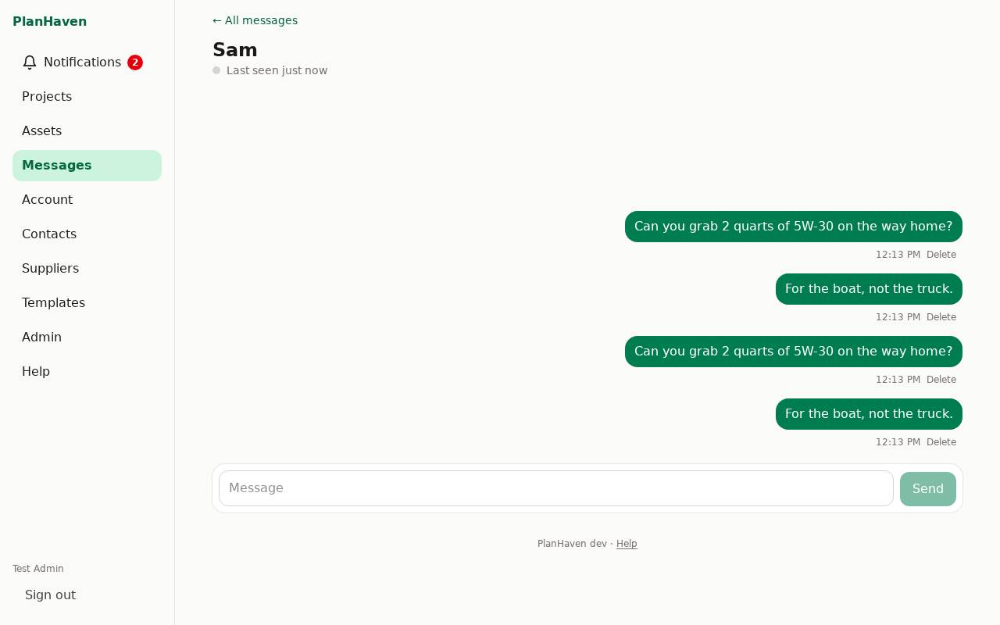

# Messages

Write to anyone on your PlanHaven, one to one or in a group, and see who's online.

## Start a conversation

- **On a phone**: **Messages** in the bottom bar.
- **On a computer**: **Messages** in the menu on the left.

A dot on **Messages** means there's something unread.

1. Tap **New message**.
2. Tap the person. A green dot means they're online now; otherwise it says when they were last here.
3. Type in **Message** and tap **Send**. On a computer, Enter sends and Shift+Enter starts a new line.

If you already have a conversation with that person, it opens instead of starting another.

## Groups

1. Tap **New group**, give it a **Group name**, tick the people, tap **Start group**.
2. In the group, tap **Group** to rename it, **Add people**, or **Leave group** (tap twice).
   Once you leave, you no longer see the group; someone in it can add you back.

## Delete a message

Tap **Delete** under your own message, then **Tap again to delete**. Its text is removed for
everyone (it shows as "Message deleted"), and from any alert that showed it.

## Alerts

You get one alert per conversation until you open it (see [Notifications](notifications.md)).
It shows who wrote and the start of the message. To keep messages off your lock screen, untick
**Show the start of messages in alerts** in **Account** under **Notifications**.

## Online status

Others see a green dot while you have PlanHaven open, and "Last seen" otherwise. To hide both,
tick **Hide my online status** in **Account**.

## Privacy

Only the people in a conversation can read it; admins can't. Like notes, messages are stored on
your PlanHaven server, so whoever runs the server could read them in its database. They aren't
end-to-end encrypted.
