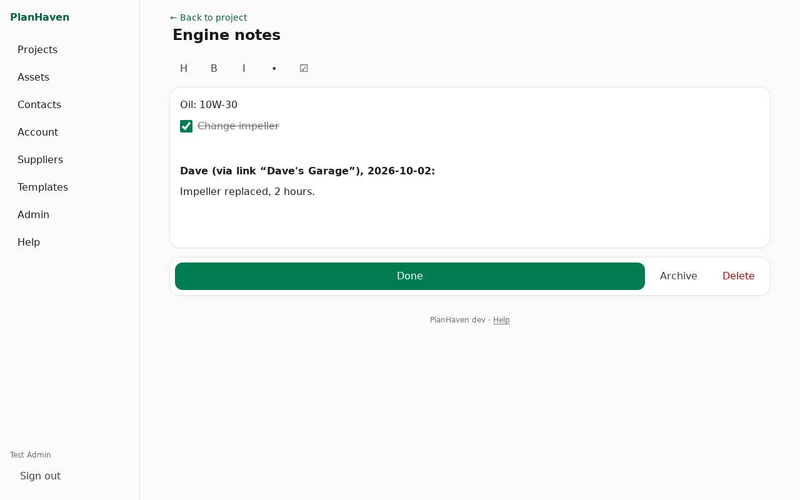
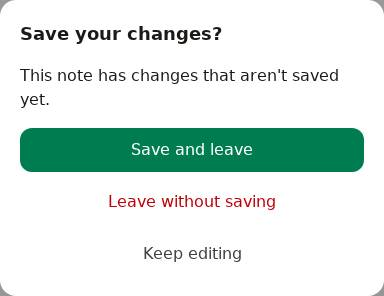
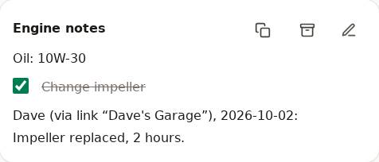

# Notes

## Start a note

1. On the project, tap **+ Note**.
2. Optionally type **Name of the new note**, then tap **Create and write**.

## Write

- The toolbar: **H** (heading), **B** (bold), **I** (italic), **•** (bulleted list), **☑** (checklist).
- Typing `[ ] ` at the start of a line also starts a checklist.

## Save with Done

Nothing is saved until you tap **Done** at the bottom of the screen. Done saves and takes you
back to the project. **Not saved yet** next to it means there are changes.

If you leave with unsaved changes (the back link, the menu, or the browser's back button),
PlanHaven asks: **Save and leave**, **Leave without saving**, or **Keep editing**.

If the note was saved elsewhere while you were writing (by someone else, or by you on another
device), PlanHaven keeps both changes when they don't overlap (say, they renamed it and you
wrote in it). If you both changed the text, nothing is lost; you choose:

- **Keep mine**: your version replaces theirs.
- **Keep both (mine as a copy)**: yours is saved as a new note "(my copy)", and this one shows theirs.
- **Keep theirs (discard mine)**: your changes are dropped.

## Note cards on the project

- A card shows the note as written: text, headings, bullets and checkboxes, in order.
- Long notes: **Show all (n more)** / **Show less**. The card stays that way when you come back (on this device).
- Tick a checkbox right on the card; it's saved at once.
- Tap anywhere else on the card (the words, ✎ **Edit note**, or the title) to open the note. The copy button puts the whole note on the clipboard as plain text (☐ and ☑ for checkboxes).
- Notes are listed newest first and stay put when edited or ticked.

## Archive a note

Done with a note but want to keep it? Archive it: it leaves the project page but isn't deleted.

1. Tap the archive button (the box icon) on its card, or **Archive** at the bottom of the open note.
2. Archived notes are under **Archived (n)** below the project's notes. Tap one to read it, or **Restore** to put it back on the page.

## Delete a note

Open it and tap **Delete** at the bottom (twice). It goes to the [Trash](trash.md).
