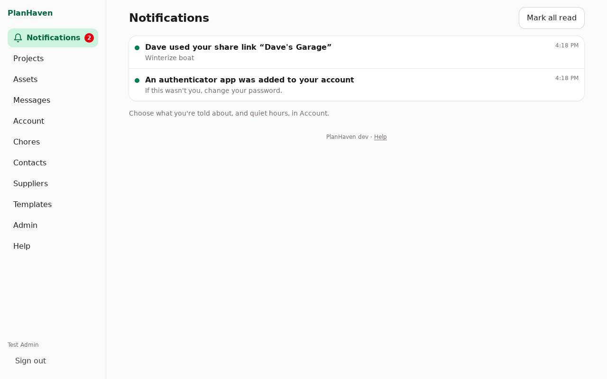
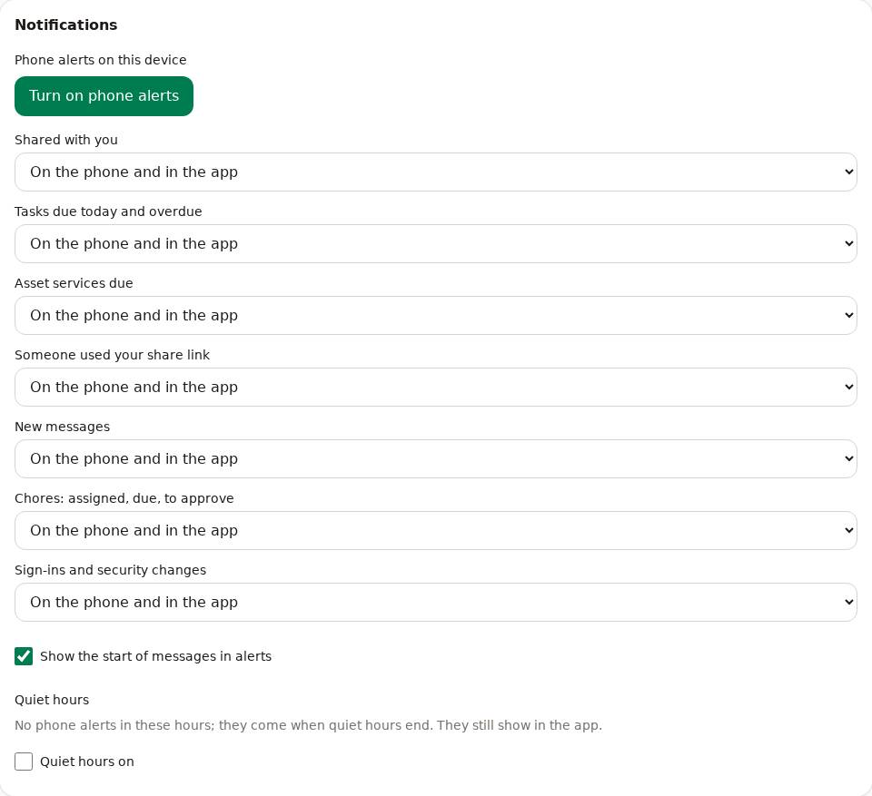

# Notifications

PlanHaven tells you when something needs you: in the app, and (if you turn it on) as an alert
on your phone or computer, even when PlanHaven is closed.

## The bell

- **On a computer**: **Notifications** at the top of the menu, with the number of unread ones.
- **On a phone**: the bell in the bottom bar, with a red number when something is unread.

Tap a notification to go where it's about (the project, the asset, ...). It's then marked as
read. **Mark all read** clears the number.

You're told about:

- **Shared with you**: someone shared a project, asset, contact or template with you.
- **Tasks due today and overdue**: tasks with a due date, on the day and once if they're late
  (for tasks assigned to you, or else to the project's owners and editors).
- **Asset services due**: a maintenance schedule that's due soon or overdue (see [Assets](assets.md)).
- **Someone used your share link**: a guest ticked something, added to a note or added photos
  (at most once an hour per guest).
- **Chores**: a chore given to you, when it's due (and a reminder), one to approve, and
  approved or sent back (see [Chores](chores.md)).
- **New messages**: one per conversation until you open it (see [Messages](messages.md)). **Show
  the start of messages in alerts** can be unticked to keep the text off your lock screen.
- **Sign-ins and security changes**: a sign-in from somewhere new, a password or second factor
  change. These can't be turned off.

## Phone alerts

**On an iPhone**: alerts only work in the app added to the Home Screen.
1. In Safari, open PlanHaven, tap **Share**, then **Add to Home Screen**.
2. Open PlanHaven from the Home Screen icon.
3. Go to **Account**, and under **Notifications** tap **Turn on phone alerts**, then **Allow**.

**On Android or a computer**: in **Account**, under **Notifications**, tap **Turn on phone
alerts**, then **Allow**.

Then tap **Send a test**: an alert should appear within a few seconds. Turn on alerts on each
device you want them on; the devices are listed, and ✕ stops alerts on one. Signing out also
stops them on that device.

## Choose what you're told about

In **Account**, under **Notifications**, set each kind to:

- **On the phone and in the app**
- **In the app only**: no phone alert.
- **Off**: not shown at all.

## Quiet hours

Tick **Quiet hours on** (22:00 to 07:00 to start with) and change the times with **From**,
**To** and **Save quiet hours**. Phone alerts wait until quiet hours end; notifications still
show in the app straight away. Times follow your device's time zone.

## Privacy

Alerts carry only a title and a short line (a task or asset name, who shared something, the
start of a message unless you turned that off), never the text of notes. An alert you've
already read in the app isn't sent to your phone. They go through your phone's or browser's own alert service (Apple, Google,
Mozilla or Microsoft), encrypted so that service can't read them.
