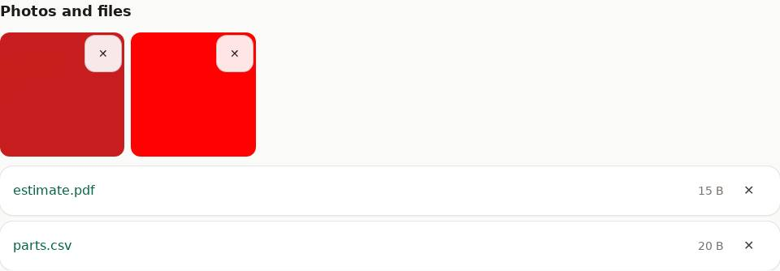

# Photos and files

## Add

### On a phone

1. On the project, tap **+ Photo or file**.
2. **Take photo** opens the camera; **Add photos or files** picks photos or files already on
   the phone (several at once is fine).

### On a computer

1. On the project, click **+ Photo or file**.
2. **Add photos or files** and pick them (several at once is fine).

iPhone photos (HEIC) work. PDFs, documents, spreadsheets and drawings can be added too.

## Location is removed

Photos are cleaned when uploaded: the location and camera details are removed. To keep them
(for example for insurance), tick **Keep photo location and camera details** before adding.

## View and delete

- Tap a photo to open it full size; tap a file's name to download it.
- ✕ deletes it (it goes to the [Trash](trash.md)).
- To show one photo big on the project page, give it its own tile (see [Arranging](arranging.md)).
