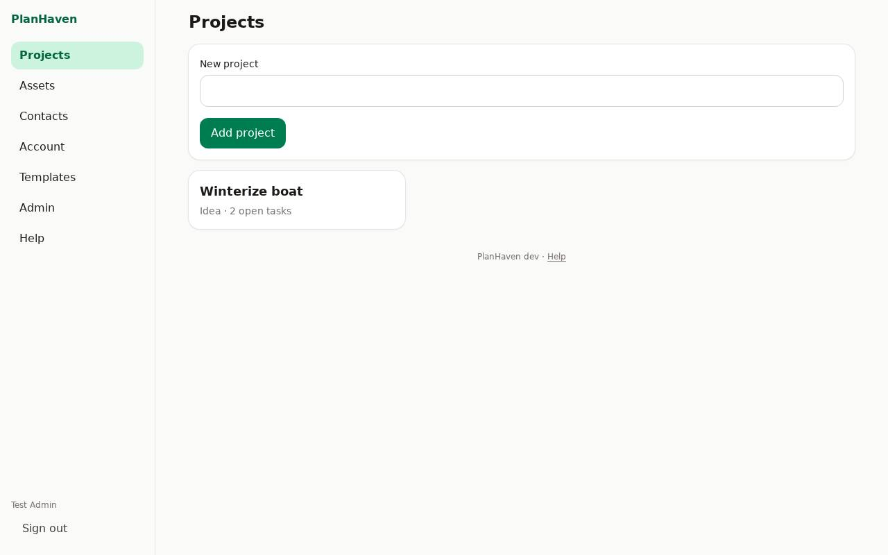
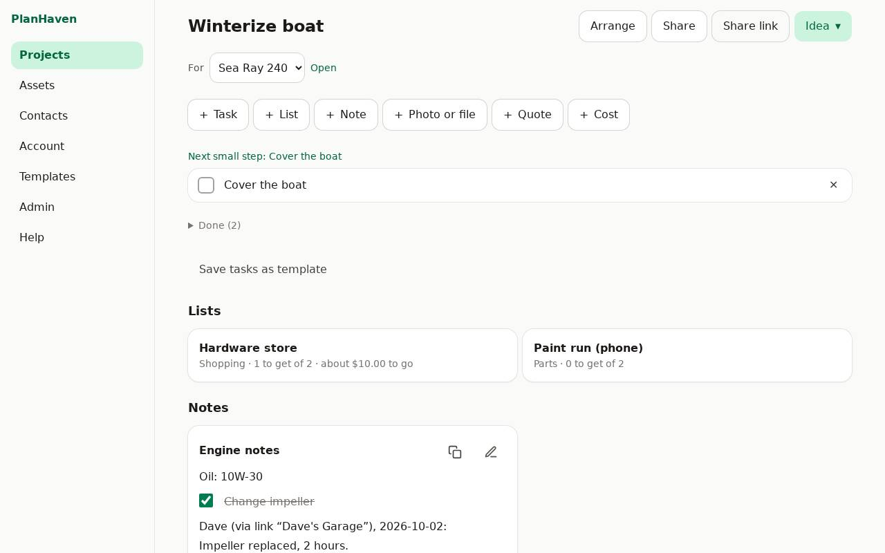
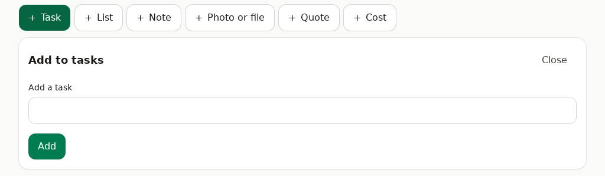
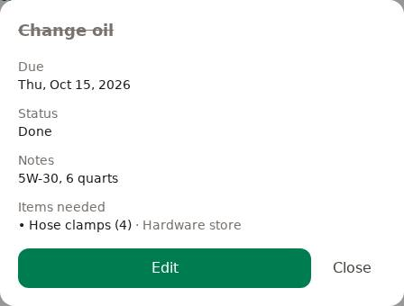

# Projects and tasks

A project is anything with a goal: winterizing the boat, a new deck, a car service.

## Start a project

1. On **Projects**, type its name in **New project** and tap **Add project**.
2. The project page opens.

## The project page

## Stages

Each project has a stage: **Idea → Planning → Ready → In progress → Done → Archived**. Tap the
stage button at the top of the project to change it.

## What it's for (an asset)

Link a project to an asset (the boat, the car, the house) with the asset picker under the
title. The asset's page then lists the project in its history. See [Assets](assets.md).

## The add bar

Everything you add to a project starts from the bar under the title:
**+ Task, + List, + Note, + Photo or file, + Quote, + Cost**. Tap one and a drawer slides down
with its form; tap it again or **Close** to put it away. The bar stays at the top of the
screen while you scroll down the project, so adding is always one tap away.

- **On a phone** the buttons sit in two rows of three.
- **On a computer** they're in one row.

## Tasks

1. Tap **+ Task**, type in **Add a task**, tap **Add**. The drawer stays open so you can add several.
2. Tick a task's box to mark it done. Done tasks move to **Done (n)**, below the open ones.
3. The first open task is shown as **Next small step**.
4. Tap a task's name to see its details: due date, notes and the items it needs.
5. To change it, tap **Edit** in the details: its **Title**, **Notes**, **Due date** and **Items needed**, then **Save**. ✕ beside the task deletes it.

If the same task was changed on another device while you were editing (by someone else, or by
you), PlanHaven keeps both changes when they're to different things (say, they ticked it and
you added notes). If you both changed the same thing, you choose: **Keep mine** or **Keep theirs**.

### Tasks from a template

- **Save tasks as template** (under the tasks) keeps the open tasks for later projects.
- **+ Task** → **Or add tasks from a template…** adds them to this project.

See [Templates](templates.md).

### Items a task needs

A task can need items from the project's lists (for example "Change oil" needs the oil and
the filter from the Hardware store list).

1. Tap the task, then **Edit**, and pick the items under **Items needed**, then **Save**.
2. The task then shows how many are still to get ("Needs 1 of 2 items: Oil filter") until they're checked off on the list.

## Deleting a project

Only the owner can. At the bottom of the project, tap **Delete project** and confirm. It goes
to the [Trash](trash.md) for 30 days.
