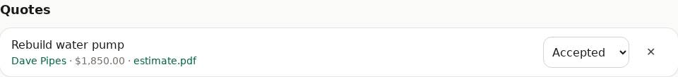
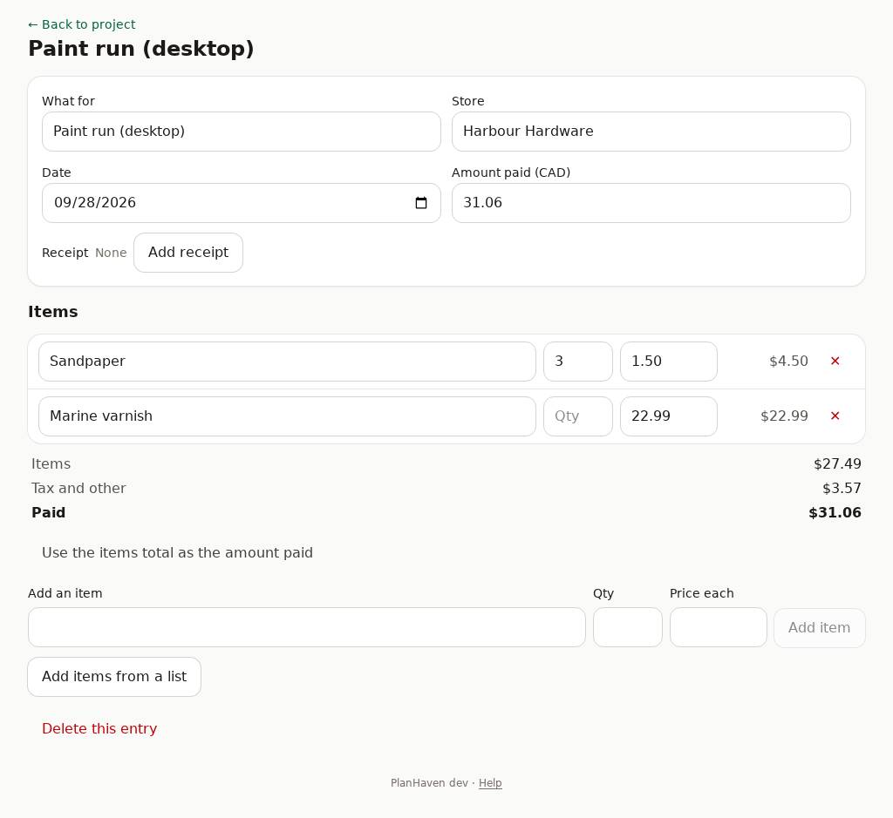
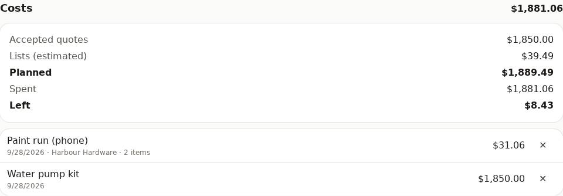

# Quotes, costs and purchases

Amounts are in Canadian dollars (CAD).

## Quotes (estimates from contractors)

1. Tap **+ Quote**. Enter **What for**, pick the **Contact**, and the **Amount (CAD)** if you have it (leave it empty if you've only asked).
2. **Upload the estimate** (a PDF or photo), or pick a file already on the project under **Document**.
3. Tap **Add quote**.

Later, on the quote:

- **Attach estimate** if it has no document yet.
- Change its status: **Requested**, **Received**, **Accepted**, **Declined**. An **accepted** quote counts in the budget.

## Costs: money spent

For a quick entry: tap **+ Cost**, enter **Money spent on** and **Amount (CAD)** (and, if it
was for an accepted quote, pick it under **Paid for quote**), tap **Add cost**.

## Purchases: store, receipt and items

Tap an entry in the **Costs** tile to open it. Everything here is optional:

- **Store**, **Date**, **Amount paid (CAD)**: saved when you leave the box.
- **Receipt**: **Take photo** (phone) or **Add receipt** (a photo or PDF). **Replace** or **Remove** later.
- **Items**: type them in (**Add an item**, **Qty**, **Price each**), or **Add items from a list** to pick checked-off items with their estimated prices. Change each price to what you actually paid.
- The totals show **Items**, **Tax and other** (the difference), and **Paid**. **Use the items total as the amount paid** if you prefer.
- **Delete this entry** (tap twice).

Tip: from a list, **Record purchase** does most of this for you (see [Lists](lists.md)).

## The budget

The **Costs** tile shows the budget:

- **Accepted quotes** + **Lists (estimated)** = **Planned**
- **Spent**, and what's **Left** (or **Over by**, in red)
