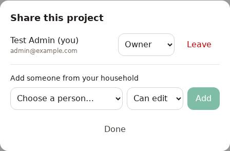
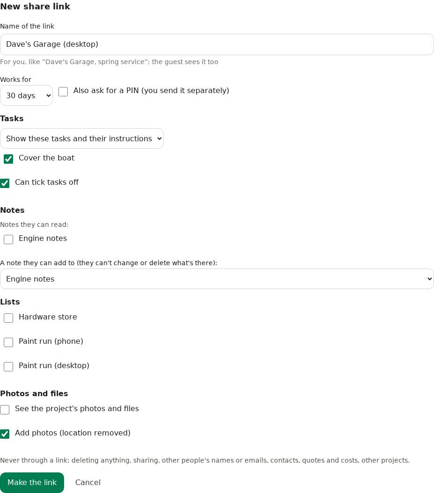
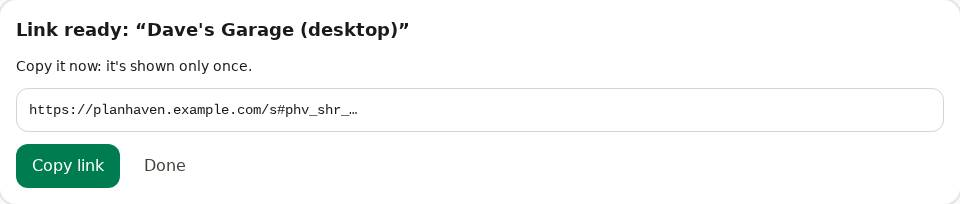
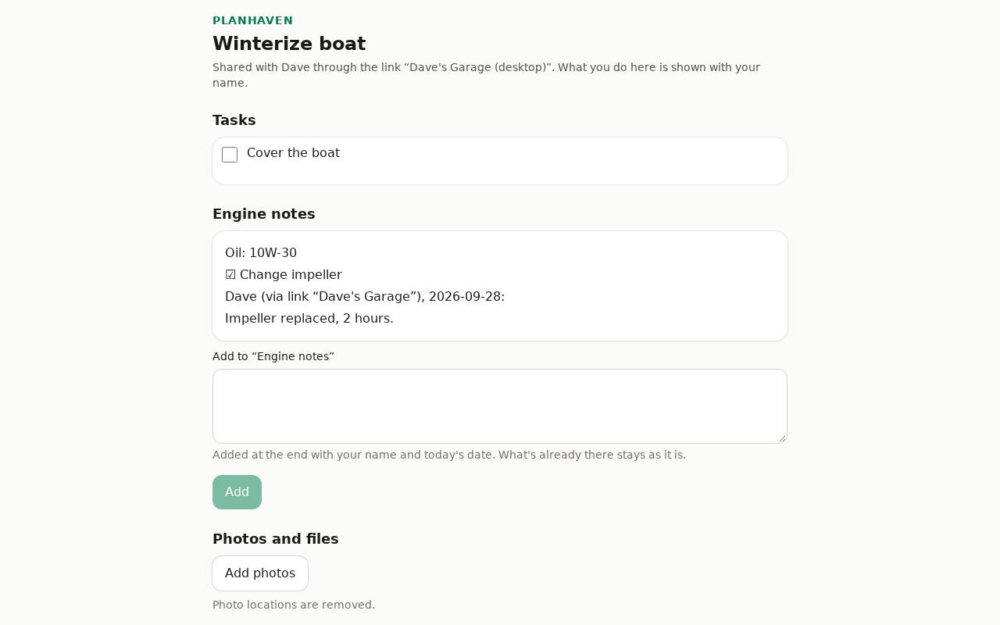

# Sharing

Everything starts private. You share each project, contact or asset one by one with people in
your household (people with an account on this PlanHaven).

## Share

1. On the project (or contact, or asset), tap **Share**.
2. You may be asked to **Confirm it's you** (your passkey or 6-digit code): sharing is sensitive.
3. Under **Add someone from your household**, choose the **Person** and **Their role**:
   - **Can view**: sees everything, changes nothing.
   - **Can edit**: can add and change things too.
4. The list of **Members** shows who has access. Change someone's role, or **Remove** them.

Only the owner can share.

 Anyone can **Leave** something shared with them.

## What people see

- Changes by others show up within seconds while the page is open.
- A shared project's page is shown in the owner's arrangement until the person arranges it themselves.

## Share links: for people without an account

A mechanic, a contractor, a neighbour: send them one link, and they see and do exactly what you
tick, without an account. Anyone who has the link can use it, so send it only to them.

### Make a link

1. On the project, tap **Share link** (next to **Share**; owners and editors).
2. Tap **Make a share link**, and fill it in:
   - **Name of the link**: for you, like "Dave's Garage, spring service" (they see it too).
   - **Works for**: 1 day to 1 year (30 days unless you change it).
   - **Also ask for a PIN**: off unless you tick it. If you tick it, send the PIN separately
     (a text message, say).
   - **Tasks**: show the ones you tick (or all of them), with their instructions, and whether
     they **Can tick tasks off**.
   - **Notes**: which notes they can read, and **a note they can add to**. They can only add
     at the end; what's there never changes.
   - **Lists**: which lists they see, and whether they **Can tick items off**.
   - **Photos and files**: whether they see them, and whether they can **Add photos**.
3. Tap **Make the link**. You may be asked to **Confirm it's you**.
4. **Copy link** (or **Share…**) and send it. It's shown only once.

Never through a link: deleting anything, sharing, other people's names or emails, contacts,
quotes and costs, other projects.

### What they see

They open the link, type their name (and the PIN, if you asked for one), and get a simple
page with only what you ticked. Everything they do is recorded with their name: ticks, what
they added to a note ("Dave (via link "Dave's Garage"), 2026-09-28: ..."), photos. Photo
locations are removed.

### Activity, and turning a link off

On **Share link**, each link shows how long it works and when it was last used.

- **Activity** lists who did what, and when.
- **Turn off** (tap twice) stops the link at once, for everyone who has it.

A link also stops by itself when it expires, when the project is deleted, or when the person
who made it can no longer edit the project.
