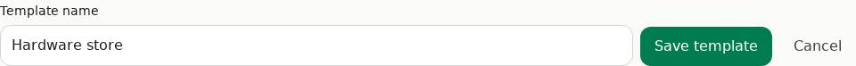
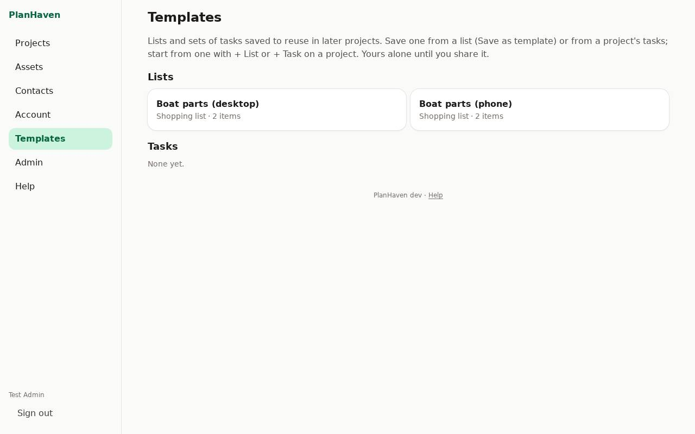
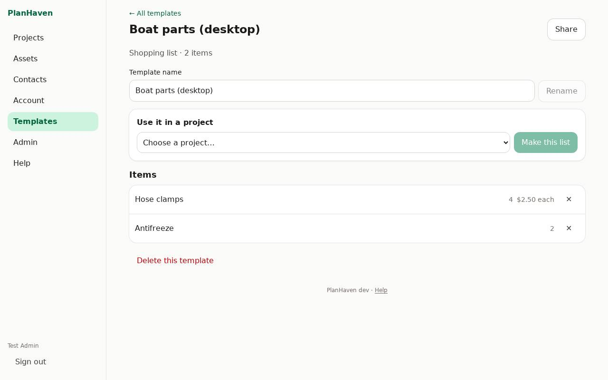

# Templates

Save a list, or a project's tasks, to use again in later projects: the hardware run you do
every fall, the steps to winterize the boat. A template is **yours alone** until you share it.

## Save a list as a template

1. Open the list and tap **Save as template** (under the items).
2. Give it a name (the list's name is filled in) and tap **Save template**.
3. **Open** takes you to the template.

All the items come along, with their quantities and estimated prices.

## Save a project's tasks as a template

On the project, under the tasks, tap **Save tasks as template**, give it a name and tap
**Save template**. The open tasks come along, with their notes, in their order.

## Use a template

On a project:

- **+ List** → **Or start from a template…** → pick one → **Use template**. A new list is made
  with the template's name and items, and opens.
- **+ Task** → **Or add tasks from a template…** → pick one → **Use template**. The tasks are
  added to the project.

Or, from the template's page: under **Use it in a project**, choose the project and tap
**Make this list** (or **Add these tasks**).

What's made from a template is a copy: changing the template later doesn't change it.

## Your templates

### On a phone

Open **Account** → **Templates**.

### On a computer

**Templates** is in the menu on the left.

On a template's page you can:

- **Rename** it (**Template name**, then **Rename**).
- Remove an item with ✕.
- **Share** it with someone in your household (see [Sharing](sharing.md)). **Can view** lets
  them use it; **Can edit** also lets them rename it and remove items.
- **Delete this template** (tap twice; only the owner). It's gone at once, not to the trash;
  lists and tasks made from it stay.

